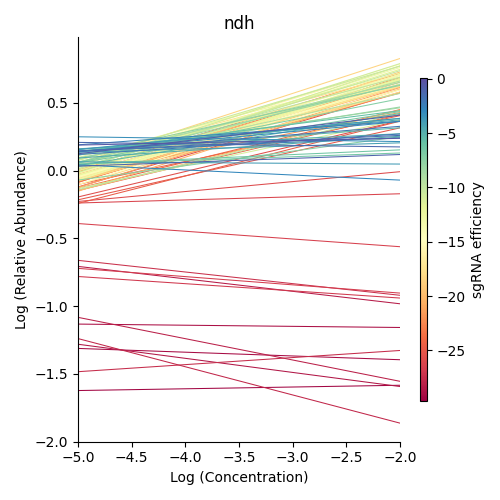
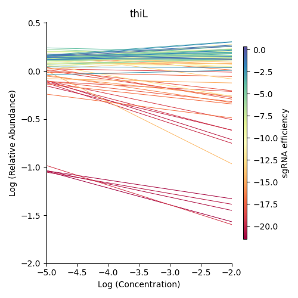

.. _cgi:

CRISPRi-DR
==========
CRISPRi-DR is designed to analyze CRISPRi libraries from CGI experiments and identify significant CGIs ie genes that affect sensitivity to the drug when depleted. 

`Choudhery S, DeJesus MA, Srinivasan A, Rock J, Schnappinger D, Ioerger
TR. A dose-response model for statistical analysis of chemical genetic
interactions in CRISPRi screens. PLoS Comput Biol. 2024 May
20;20(5):e1011408. doi: 10.1371/journal.pcbi.1011408. PMID: 38768228;
PMCID: PMC11104602. <https://pubmed.ncbi.nlm.nih.gov/38768228/>`_

Workflow
--------
Starting with fastq files, barcode counts are extracted. The user creates their own metadata file, for the counts. Fractional abundances are and used to run the CRISPRi-DR model. The output of this model is a file that lists genes with their statistacal parameters and significance. Genes with significant interactions are those with qval of concentration dependence < 0.05 and ebFDR < 0.05 on the slope coefficient. However, genes can be ranked by depletion by sorting the coefficient of concentration dependence in ascending order

Command-line Steps
------------------

**Preprocessing: Fastq to Count Files** 

This is a longer process, taking a few minutes each. However, the number of reads processed is printed to the console to indicate progress.

::

    > python3 ../src/transit.py cgi extract_counts <fastq_file> <sgRNA info file> <barcode column> <counts_file> [Optional Arguments]

    Optional Arguments:
        -delete_temp_fastQ := if fastq files are provided as gzipped files, this flag indicates whether user would like to delete the temp uncompressed files

* **<fastq_file>** : raw reads in *.fastq or *.fastq.gz (gzipped) format (if gzipped, they will be automatically uncompressed)

* **-delete_temp_fastq** (optional flag) : if gzipped files were provided, the user can add this flag to automatically delete the temporary uncompressed files afterward, to help save disk space

* **<sgRNA info file>** : A tab-separated text file that contains metadata for each sgRNA, where the columns include:

    1. sgRNA ids (user defined, must be unique per sgRNA). Must be first column for both command line and GUI usage
    2. Orfs targeted by the sgRNA, 
    3. Barcodes (nucleotide sequences) of the sgRNAs
    4. sgRNA efficacies (measurements of effect on growth rate; in the publication of this method, sgRNA efficacy is estimated log2-fold-change in CFU at 25 generations (induced vs uninduced), calculated through a passaging experiment).

* **<barcode column>** : Column name of the sgRNA info file that contains the barcodes of the sgRNA (first column is the sgRNA ids)

    *  The barcode sequence in this column will be reverse complemented before when scanning the reads.
    * If the column header has spaces, put it in quotes, like "barcode column"

.. note::
        * The order of columns in the sgRNA info file is required to be as listed above if using the GUI implementation.  Order of columns doesn't matter for the command-line option - the barcode column can be specified by name as an argument.
        * Other columns are allowed in the sgRNA info file (in the case of GUI usage, these extra columns should be after the first four listed above)

**Step 1: Combine Individual Counts File to a Combined Counts File**
This is a fairly fast process. It takes at most a minute for the combination of 12 files with 2 columns (sgRNA id and counts) to one large file of 13 columns (first column sgRNA id and remaining columns are counts from the files entered). 

::

    > python3 ../src/transit.py cgi combine_counts <comma separated headers> <counts file 1> <counts file 2>  ... <counts_file n>  <combined counts file>

* counts files : sgRNA ids as their first column, and can have any number of columns.
* comma-separated headers: the column names of the combined counts file
    .. note::
        the comma-separated headers must be in the same order as the columns in the count files(s) provided
 

**Step 2: Extract Fractional Abundances**

 This is a relatively quick process, taking less than a minute. This step is to turn the barcodes counts into relative normalized abundances. Counts are normalized within samples and calculated relative to the abundances in the uninduced ATC file, essentially fractions. The first few lines of the output file contains information about the counts files processed.

::

    > python3 ../src/transit.py cgi extract_abund <combined counts file> <samples metadata file> <control condition> <sgRNA info file> <efficacy column> <orf column> <uninduced ATC file> <drug> <days> <fractional abundance file> [Optional Arguments]

    Optional Arguments: 
        -no_uninduced := flag to calculated fractional abundances without uninduced abundances. if do not have a uninduced counts, you can set this flag and they will be approximated

* samples metadata file (USER created):

    * The columns expected in this file: column_name, drug, conc_xMIC, days_predepletion

        * column_name: the corresponding header name(s) in the combined counts file
        * conc_xMIC is the concentration of the drug the sample is treated with 
        .. warning::
            conc_xMIC must be a numerical value, ie. 0.5 and not a categorical value such as "low" or "high"
        * Equal number of replicates for all concentrations are not nessessary
        * see [Li, S et al. 2022, PMID: 35637331] for explanation of days_predepletion

    * Example metadata: ``transit/src/pytransit/data/CGI/counts_metadata.txt``

* control condition: The condition to to be considered the control for these set of experiments, as specificed in the "drug" column of the metadata file; typically an atc-induced (+ ATC) with 0 drug concentration condition.

* sgRNA info file: A file that contains metadata for each sgRNA in the combined counts file, where the columns are as specified above.

* uninduced ATC file: A two column file of sgRNAs and their counts in uninduced ATC (no ATC) with 0 drug concentration. **If you do not have a file with uninduced counts, you can set the '-no_uninduced' flag**. If the **-no_uninduced** flag is set, then uninduced abundances are approximated from the standard coefficient of variation (SCV) across the induced counts.

* drug : Name of the drug in the "drug" column of the metadata file passed in to be fit in the model

* days: Sampled from predepletion day as listed in the "days_predepletion" column of the metadata file to be used in the analysis

**Step 3: Run the CRISPRi-DR model**

This is a relatively quick process, taking at most 3 minutes for a dataset of ~90,000 sgRNAs . This step fits the CRISPRi-DR model (statistical analysis of concentration dependence for each gene) to each gene in the file and prints each output to the <CRISPRi-DR results file> in a tab separated file. 
::

    > python3 ../src/transit.py cgi run_model <fractional abundance file>  <CRISPRi-DR results file> [Optional Arguments]
        
    Optional Arguments: 
        -use_negatives := flag to use negative controls to calculate significance of coefficients of concentration dependence

.. warning::
    The *use-negatives* flag allows the user to use sgRNAs ID containing "Negative" to calculate Zscores of coefficients of concentration dependence in the final filtering step, as opposed to using the distribution of coefficients for all genes. The significant genes assessed with this flag are those with qval concentration dependence <0.05 and \|Z scores of concentration dependence\| > 2. It does NOT include the empirical Bayes filter. 

The output file has the following columns:

+--------------------------------------+---------------------------------------------------------------------------------------------------------------+
| Column Header                        | Column Definition                                                                                             |
+======================================+===============================================================================================================+
| Significant Interactions             | 0=no interactions. 1=enriched, -1=depleted are those with adjusted P-val (Q-val) < 0.05 and ebFDR < 0.05      |
+--------------------------------------+---------------------------------------------------------------------------------------------------------------+
| Orf                                  | Orf name of the gene                                                                                          |
+--------------------------------------+---------------------------------------------------------------------------------------------------------------+
| Gene                                 | Gene Name                                                                                                     |
+--------------------------------------+---------------------------------------------------------------------------------------------------------------+
| Nobs                                 | Number of sgRNAs targeting the gene                                                                           |
+--------------------------------------+---------------------------------------------------------------------------------------------------------------+
| intercept                            | Intercept of the CRISPRi-DR model fit to the gene                                                             |
+--------------------------------------+---------------------------------------------------------------------------------------------------------------+
| coefficient sgrna efficiency         | Measure of the affect of sgRNA efficiency on changes in abundances with increasing concentration              |
+--------------------------------------+---------------------------------------------------------------------------------------------------------------+
| coefficient concentration dependence | Measure of the affect of increasing concnetration on changes in abundances                                    |
+--------------------------------------+---------------------------------------------------------------------------------------------------------------+
| pval intercept                       | P-value of the intercept                                                                                      |
+--------------------------------------+---------------------------------------------------------------------------------------------------------------+
| pval sgrna efficiency                | P-value of the coefficient of sgRNA efficiency                                                                |
+--------------------------------------+---------------------------------------------------------------------------------------------------------------+
| pval concentration dependence        | P-value of the coefficient of concentration dependence based on Wald test                                     |
+--------------------------------------+---------------------------------------------------------------------------------------------------------------+
| qval concentration dependence        | Adjustment of the P-values calculated from the coefficient of concentration dependence                        |
+--------------------------------------+---------------------------------------------------------------------------------------------------------------+
| Z scores of concentration dependence | Z scores of the coefficient of concentration dependence                                                       |
+--------------------------------------+---------------------------------------------------------------------------------------------------------------+
| locfdr                               | Estimated local false discovery rate for each gene using Empirical Bayes                                      |
+--------------------------------------+---------------------------------------------------------------------------------------------------------------+
| ebFDR                                | Calculated global false discovery rate for each gene using Empirical Bayes                                    |
+--------------------------------------+---------------------------------------------------------------------------------------------------------------+

.. note::
   The column of coefficient concentration dependence is the columns of interest. The Z-scores and adjusted P-values are calculated from this column and used to determine significant interactions. When the output file is sorted on the slope of concentration dependence, the user can rank the genes based on amount of depletion.

**Visualize Concentration-Dependence of sgRNAs for Specific Genes**

This process is fairly quick, taking less than a minute to run. This figure visualizes the amount of depletion in a gene at the sgRNA level. If control concentration provided is 0, the lowest value on the x-axis in the plot refers to this concentration (due to taking log concentration, 0 concentration is treated as a teo fold lower than the lowest concentration.) The slope of relative abundance (fraction of abundance of counts in ATC induced vs. ATC uninduced) versus log2(concentration) for each sgRNA is calculated and plotted, colored by sgRNA strength based on a blue-orange gradient (as seen here):

::

    > python3 ../src/transit.py cgi visualize <fractional abundance file> <orf> <output plot location> [Optional Arguments]
    
    Optional Arguments: 
        --fixed xmin=x,xmax=x,ymin=y,ymax=y := set the values you would to be fixed in this comma seperated format. Not all values need to be set for ex, a valid arguement is "xmin=0,ymax=5"
        --origx := flag to turn on original scale axes rather than log scale for Concentration default=off
        --origy := flag to turn on original scale axes rather than log scale for Realtive Abundances default=off

* fractional abundance file : Fractional abundance file as created in Step 2. 

    .. warning::
        This visualization assumes the columns are in increasing order of concentration, with the first three abundance columns (after the column "sgRNA strength"), as the control. This order depends on the order of columns during the creation of the combined counts file in Step 1.

* gene : select a member from the orf column to visualize.
* output plot location : The location where to save the generated plot.

.. note::
    If comparing plots from different genes, note the scale of sgRNA strength shown in the plots.

Run-time
--------

| The CRISPRi-DR method is fairly quick process. The creation of abundance file should not take more than a minute and the running of the model itself takes a few minutes, dependent on the size of the library.
|

.. rst-class:: transit_sectionend
----

GUI
---

There is a menu item in the GUI (under Methods) 
for analyzing CRISPRi CGI data using the CRISPRi-DR method.

.. NOTE::
 You first have to run the '**extract_counts**' and '**combine_counts**'
 commands (above) **at the command line** to convert .fastq files to a
 combined_counts file.  The combined_counts and other input files can then be
 provided through the GUI, which does the '**extract_abund**' and
 '**run_model**' steps above.

Note: The input files for CRISPRi-DR analysis are specified in the
parameters panel on the right-hand side (4 filenames).  You do not have to load
anything into the Samples or Conditions windows.
Dropdowns for selecting Drug and Control will appear AFTER loading metadata.

When the method finishes, you can look at the output file in the Results window.
Click on the output file in the Results window, and actions 'Display Table'
and 'Display Gene' will appear in a dropdown.

 * **Display Table**. The first column indicates 'Significant Interactions' (-1 for depleted genes, +1 for enriched). Genes that represent statistically significant interactions are defined as those that have Qvalue<0.05 and |Zscore|>2.0.

 * **Display Gene**.  Show a plot of slopes for sgRNAs (regressions of abundance vs drug concentration), colored by sgRNA strength (see the example Visualization above).  User can specify genes by ORF id or gene name; multiple genes can be given via a comma-separated list.

Example Data
------------

If you want to test-run this analysis, you can load example files in the data directory:
transit/src/pytransit/data/CGI/.  This is for an experiment where an *M. tuberculosis*
CRISPRi library was treated with rifampicin (data from Jeremy Rock's lab;
`Li et al, 2022 <https://pubmed.ncbi.nlm.nih.gov/35637331/>`_).

+----------------------------------+-----------------------------------------------------------------------------------------------+
|                                  | in transit/src/pytransit/data/CGI/                                                            |
+==================================+===============================================================================================+
| Combined counts file:            | `RIF_D1_combined_counts.txt <https://orca1.tamu.edu/CRISPRi-DR/RIF_D1_combined_counts.txt>`_  |
+----------------------------------+-----------------------------------------------------------------------------------------------+
| Metadata file:                   | `samples_metadata.txt <https://orca1.tamu.edu/CRISPRi-DR/samples_metadata.txt>`_              |
+----------------------------------+-----------------------------------------------------------------------------------------------+
| sgRNA info:                      | `sgRNA_info.txt <https://orca1.tamu.edu/CRISPRi-DR/sgRNA_info.txt>`_                          |
+----------------------------------+-----------------------------------------------------------------------------------------------+
| Uninduced counts (-ATC control): | `uninduced_ATC_counts.txt <https://orca1.tamu.edu/CRISPRi-DR/uninduced_ATC_counts.txt>`_      |
+----------------------------------+-----------------------------------------------------------------------------------------------+

.. rst-class:: transit_sectionend
----

Tutorial
-------

This tutorial shows commands relative to this directory. Files in the ``transit/src/pytransit/data/CGI`` directory are: 

* samples_metadata.txt - describes the samples
* sgRNA_info.txt - contains metadata for sgRNAs including orfs targeted, barcode sequences and efficacies
* uninduced_ATC_counts.txt - counts for uninduced ATC (no induction of target depletion) library
* RIF_D1_combined_counts.txt - combined counts of the RIF 1 day predepletion data for uninduced ATC, zero, low, medium and high concentrations (output of data preprocessed and Step 1 completed)

.. note::

    If the user would like to evaluate the software, they can start with Step 2, using the *RIF_D1_combined_counts.txt* file in the ``transit/src/pytransit/data/CGI`` directory.

**Raw Data : Obtain FastQ files from NCBI using the following run numbers**

Fetch and process the following into fastQ files from `NCBI <https://www.ncbi.nlm.nih.gov/bioproject/PRJNA738381/>`_ using the SRA toolkit and place them in the ``transit/src/pytransit/data/CGI`` directory :

* Control samples (ATC-induced 0 drug concentration DMSO library with 1 day predepletion) : SRR14827863, SRR14827862, SRR14827799

* High concentration RIF in a 1 day pre-depletion library : SRR14827727, SRR14827861, SRR14827850

* Medium concentration RIF in a 1 day pre-depletion library: SRR14827760, SRR14827749, SRR14827738

* Low concentration RIF in a 1 day pre-depletion library: SRR14827769, SRR14827614, SRR14827870

**Preprocessing: Fastq to Count Files**

Create file of barcode counts from fastq files. Each fastq files reflect one replicate of a drug concentration, thus each will be converted into a file with two columns, sgNRA id and barcode counts

::
    
    > python3 ../../../transit.py cgi extract_counts RIF_fastq_files/SRR14827863_1.fastq sgRNA_info.txt Barcode DMSO_D1_rep1.counts
    > python3 ../../../transit.py cgi extract_counts RIF_fastq_files/SRR14827862_1.fastq sgRNA_info.txt Barcode DMSO_D1_rep2.counts
    > python3 ../../../transit.py cgi extract_counts RIF_fastq_files/SRR14827799_1.fastq sgRNA_info.txt Barcode DMSO_D1_rep3.counts  

    > python3 ../../../transit.py cgi extract_counts RIF_fastq_files/SRR14827769_1.fastq sgRNA_info.txt Barcode RIF_D1_Low_rep1.counts
    > python3 ../../../transit.py cgi extract_counts RIF_fastq_files/SRR14827614_1.fastq sgRNA_info.txt Barcode RIF_D1_Low_rep2.counts
    > python3 ../../../transit.py cgi extract_counts RIF_fastq_files/SRR14827870_1.fastq sgRNA_info.txt Barcode RIF_D1_Low_rep3.counts  

    > python3 ../../../transit.py cgi extract_counts RIF_fastq_files/SRR14827760_1.fastq sgRNA_info.txt Barcode RIF_D1_Med_rep1.counts
    > python3 ../../../transit.py cgi extract_counts RIF_fastq_files/SRR14827749_1.fastq sgRNA_info.txt Barcode RIF_D1_Med_rep2.counts
    > python3 ../../../transit.py cgi extract_counts RIF_fastq_files/SRR14827738_1.fastq sgRNA_info.txt Barcode RIF_D1_Med_rep3.counts 

    > python3 ../../../transit.py cgi extract_counts RIF_fastq_files/SRR14827727_1.fastq sgRNA_info.txt Barcode RIF_D1_High_rep1.counts
    > python3 ../../../transit.py cgi extract_counts RIF_fastq_files/SRR14827861_1.fastq sgRNA_info.txt Barcode RIF_D1_High_rep2.counts
    > python3 ../../../transit.py cgi extract_counts RIF_fastq_files/SRR14827850_1.fastq sgRNA_info.txt Barcode RIF_D1_High_rep3.counts 

**Step 1: Combine Counts Files to a Combined Counts File**

Combine the 12 separate counts files into one combined counts file. Here we put the control samples first (DMSO) and then the drug-treated libraries (RIF) in increasing concentration

::

    > python3 ../../../transit.py cgi create_combined_counts DMSO_D1_rep1,DMSO_D1_rep2,DMSO_D1_rep3,RIF_D1_Low_rep1,RIF_D1_Low_rep2,RIF_D1_Low_rep3,RIF_D1_Med_rep1,RIF_D1_Med_rep2,RIF_D1_Med_rep3,RIF_D1_High_rep1,RIF_D1_High_rep2,RIF_D1_High_rep3  DMSO_D1_rep1.counts DMSO_D1_rep2.counts DMSO_D1_rep3.counts RIF_D1_Low_rep1.counts RIF_D1_Low_rep2.counts RIF_D1_Low_rep3.counts RIF_D1_Med_rep1.counts RIF_D1_Med_rep2.counts RIF_D1_Med_rep3.counts RIF_D1_High_rep1.counts RIF_D1_High_rep2.counts RIF_D1_High_rep3.counts RIF_D1_combined_counts.txt 

The resulting file will have 13 columns, where the first column is sgRNA ids and the remaining are the counts for three replicates each for DMSO, RIF D1 Low Concentration, RIF D1 Med Concentration and RIF D1 High Concentration, respectively.

**Step 2: Extract Fractional Abundances**

.. note::
    As a part of this step, the *user must also generate a metadata file.* , ie. ``counts_metadata.txt``. Note the values in the conc_xMIC column is actual values (0.0625, 0.125, 0.25) and not categorical values ("low", "medium", "high") as seen in the counts file names. 

::

    > python3 ../../../transit.py cgi extract_abund RIF_D1_combined_counts.txt samples_metadata.txt DMSO sgRNA_info.txt Efficacy Orf uninduced_ATC_counts.txt RIF 1 RIF_D1_frac_abund.txt

The result of this command should be a file with a set of comments at the top, detailing the libraries used (DMSO and RIF). There should be a total of 17 columns, the last 12 of which are the calculated abundances, the first is the sgRNA ids followed by the orf/gene the sgRNA is targeting, uninduced ATC values, and sgRNA strength. 

**Step 3: Run the CRISPRi-DR model**
::

    > python3 ../../../transit.py cgi run_model RIF_D1_frac_abund.txt RIF_D1_CRISPRi-DR_results.txt

There should be a total of about 184 significant gene interactions, where 436 are significant depletions and 164 are significantly enriched. 

.. note::
    When the file is sorted on the slope of concentration dependence, the user can rank the genes based on amount of depletion.

**Visualize Specific Genes**

Here are a few samples of the interactions visualized at the sgRNA level for this experiment. Note the difference in sgRNA strength scales shown.

*Significantly depleted gene : RVBD3645*

*RVBD3645* is one of the significantly depleted genes in this experiment. In this plot, notice how most of the slopes are negative but the amount of depletion varies, where the more red slopes (higher sgRNA efficiency) are steeper than purple sgRNA slopes (lower sgRNA efficiency)

::

    > python3 ../../../transit.py cgi visualize RIF_D1_frac_abund.txt RVBD3645:RVBD3645 ./RVBD3645_lmplot.png

*Significantly enriched gene : ndh*

*ndh* is one of the signifincantly enriched genes in this experiment. In its plot, notice how sgRNAs of higher intermediate strength (yellow ones) show a strong upwards trend but those will lower strength (the purple ones) do not. In fact there a few sgRNAs that show almost no change in fractional abundace as concentration increases.

::

    > python3 ../../../transit.py cgi visualize RIF_D1_frac_abund.txt RVBD1854c:ndh ./ndh_lmplot.png #enriched

*Non-interacting gene : thiL*

*thiL* is an example on an non-interacting gene. It was found to be neither signifinicantly enriched nor depleted. Notice how in its plot, most of the slopes are fairly flat. As seen in the plots of *RVBD3645* and *ndh*, the reder slopes show greater depletion than the orange slopes, but there is no overall trend present

::

    > python3 ../../../transit.py cgi visualize RIF_D1_frac_abund.txt RVBD2977c:thiL ./thiL_lmplot.png 
