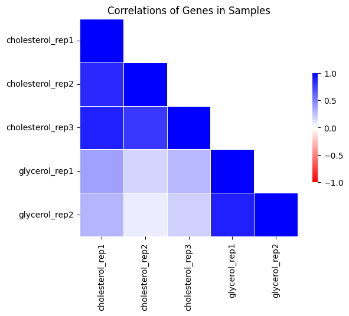
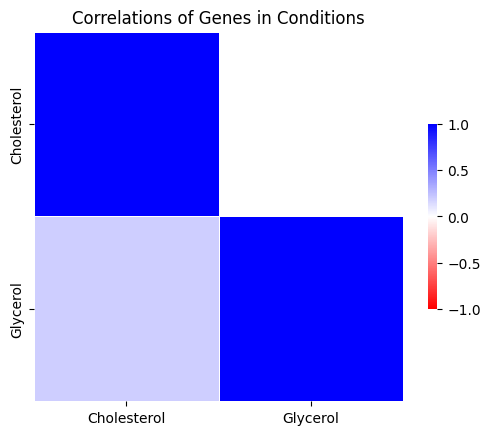
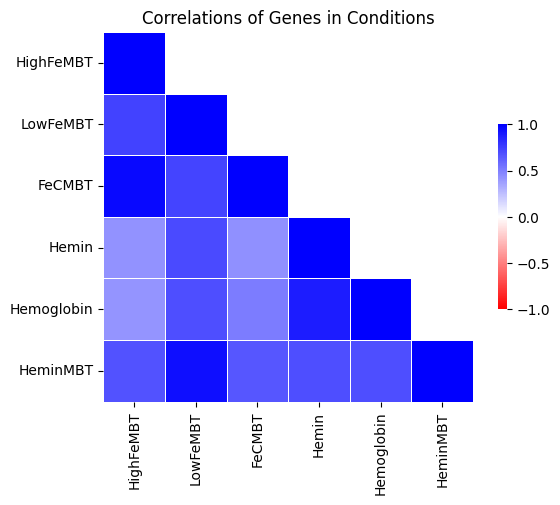
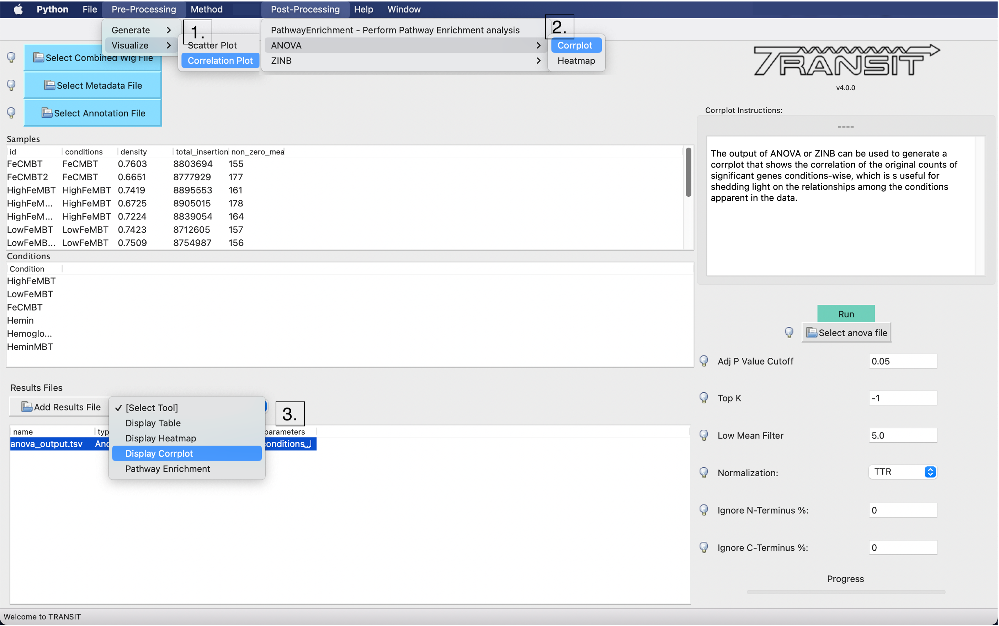
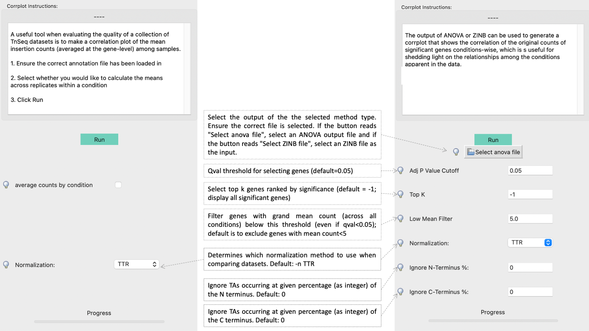

.. _corrplot:

Corrplot
========

A useful tool when evaluating the quality of a collection of TnSeq datasets is to make a
*correlation plot* of the mean insertion counts (averaged at the gene-level) among samples.
While it is difficult to state unequivocally
how much correlation there should be between samples from different conditions
(or even between replicates of the same condition),
the corrplot can often reveal individual samples which stand out as being far less
correlated with all the others (which subsequently might be excluded from analyses).

Command Line Usage
------
**As a Pre-Processing Step:**
::
    > python3 transit.py  corrplot <combined_wig_file> <metadata_file> <annotation_file> <output.png> [Optional Arguments]
    
    Optional parameters:
     -avg_by_conditions  := groups by conditions, take the mean, then show correlation between conditions. Default: False
     --n <string>        := Normalization method. Default: --n TTR
     --iN <N>            := Ignore TAs within given percentage (e.g. 5) of N terminus. Default: --iN 0
     --iC <N>            := Ignore TAs within given percentage (e.g. 5) of C terminus. Default: --iC 0

With the --avg_by_conditions flag, counts are averaged for each TA site across conditions and the corrplot is generated on those values.
Without the flag, a correaltion of the wig files is performed. 

Here are examples of making a corrplot as preliminary step to analyze possible outliers:

This corrplot was generated using the glycerol cholestrol dataset without the avg_by_condition flag. Overall
the glycerol counts are more correalted with other glycerol counts than cholestrol.
::
    > python3 src/transit.py corrplot cholesterol_glycerol.transit/comwig.tsv cholesterol_glycerol.transit/metadata.tsv H37Rv.prot_table glyc_chol_corrplot.png
      - correlations based on 3990 genes for each of the 5 wig files
|

This corrplot was generated using the glycerol cholestrol dataset with the avg_by_condition flag. We see a 
similar effect as above, where glycerol shows low correlation with cholestrol.
::
    > python3 src/transit.py corrplot cholesterol_glycerol.transit/comwig.tsv cholesterol_glycerol.transit/metadata.tsv H37Rv.prot_table glyc_chol_conditions_corrplot.png --avg_by_conditions
      - correlations based on 3990 genes averaged across wigs for the 2 conditions 
|

|

**As a Post-Processing Step:**

A corrplot can also be generated from the output of ANOVA or ZINB analysis, showing relationships among the conditions themselves
(i.e. with replicates merged, rather than correlations among individual samples).  Importantly, the correlations are based only on
the *subset* of genes identified as significantly varying (Padj < 0:05) in order to enhance the patterns, since otherwise they would be
washed out by the rest of the genes in the genome, the majority of which usually do not exhibit significant variation in counts.
::
    > python3 transit.py corrplot <combined_wig_file> <metadata_file> <annotation_file> <anova|zinb output > <output.png> -anova|-zinb
    
    Optional parameters:
     --topk            <int>  := number of results
     --qval           <float> := adjusted p value threshold. Default --qval 0.05
     --low-mean-filter <int>  := Filter out genes with grand mean count (across all conditions) below this threshold(even if adjusted p-value < 0.05). Default --low-mean-filter 5

In this case, the --avg_by_conditions flag is set to True, where counts are averaged for each TA site across conditions and the corrplot is generated on those values.
Here is an example which generates the following image showing the corrplot among several different growth conditions:
::
    > python3 src/transit.py corrplot iron.transit/comwig.tsv iron.transit/metadata.tsv H37Rv.prot_table iron_anova.out iron_anova_out.png -anova --top_k 20
    correlations of counts on top 20 genes by adjusted p-value between across wigs grouped by conditions for results of ANOVA with no reference condition

::

GUI Mode
------
The Correlation Plot can be selected from the Visualize Option in the Pre-Processing Tab of the File Menu ("1." in the example below), The checkbox in the parameter panel is equivalent to the --avg_by_conditions flag. 
Generating a corrplot on the output of ANOVA or ZINB, can be selected from the "Post-Processing" tab in the Menu Bar ("2." in the example below) or as an action on the ANOVA/ZINB output ("3." in the example below). 
If corrplot is run through the dropdown on the selected ANOVA/ZINB output, the corrplot is generated using the default parameters. If the corrplot action is selected from the Menu Bar, various parameters can be set.

The parameter panels for the two are equivalent to their relative command line usage Left is the preproccesing corrplot parameter panel whereas the right is the post-processing corrplot parameter panel:

The combined_wig, metadata and annotation files used will be those uploaded into the application

Runtime
------
This should be relatively fast, takes ~1 minute for to make one corrplot for all samples in the iron dataset

.. rst-class:: transit_sectionend
----
