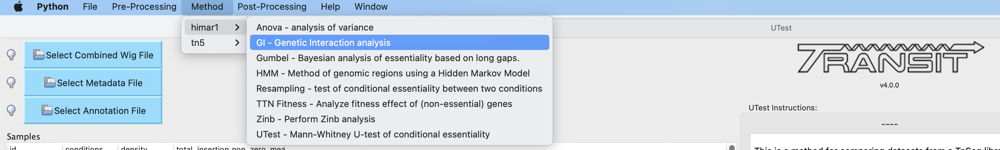
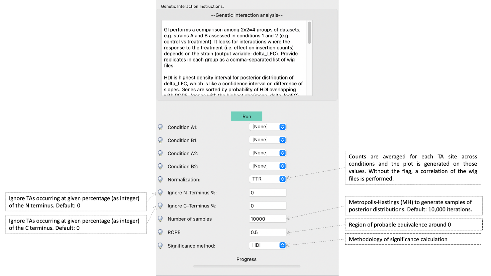

.. _genetic-interactions:

Genetic Interactions
====================

The genetic interactions (GI) method is a comparative analysis used
used to determine genetic interactions. It is a Bayesian method
that estimates the distribution of log fold-changes (logFC) in two
strain backgrounds under different conditions, and identifies significantly
large changes in enrichment (delta_logFC) to identify those genes
that imply a genetic interaction.

.. .. NOTE::
..    Can be used for both **Himar1** and **Tn5** datasets

|

How does it work?
-----------------

GI performs a comparison among 4 groups of datasets, strain A and B assessed in conditions 1 and 2 (e.g. control vs treatment).
It looks for interactions where the response to the treatment (i.e. effect on insertion counts) depends on the strain.

If you think of the effect of treatment as a log-fold-change (e.g. of
the insert counts between control and treatment in strain A), which is
like a "slope", then the interacting genes are those that exhibit a difference
in the effect of the treatment between the strains, and hence a difference in the
slopes between strain A and B (represented by 'delta_LFC' in the output file).

| For a formal description of how this method works, see our paper [DeJesus2017NAR]_:
|
|  DeJesus, M.A., Nambi, S., Smith, C.M., Baker, R.E., Sassetti, C.M., Ioerger, T.R. `Statistical analysis of genetic interactions in Tn-Seq data. <https://www.ncbi.nlm.nih.gov/pubmed/28334803>`_ *Nucleic Acids Research.* 2017. 45(11):e93. doi: 10.1093/nar/gkx128.

|

Statistical Significance
------------------------

The computation that is done by GI is to compute the posterior distribution of the delta_LFC (or mean change in slopes)
through Bayesian sampling.
The primary method to determine significance of genes is whethter this the mean_delta_LFC is significantly differnt than 0.
However, since the mean_delta_LFC is a distribution, we represent it by a Highest Density Interval, HDI, which is
similar to a 95% confidence interval.  Furthermore, rather than asking whether the HDI overlaps 0 exactly, we expand the interval
around 0 to a Region of Probable Equivalence (ROPE), which is set to [-0.5,0.5] by default.  Hence the significant genes
are those for which the HDI does not overlap the ROPE.  GI has a flag to  adjust the size of the ROPE, if desired.

In the GI output file, the final column give the significance call, along with type of interaction.
If a gene is not significant, it will be marked with "**No Interaction**" (for the HDI method, meaning HDI overlaps the ROPE).
If a gene IS significant, then its interaction will be cateogrized in 3 types (see NAR paper):

 * **Aggravating** - mean_delta_LFC is negative; gene is more required in treatment than control in the B strain, compared to the A strain
 * **Suppressive** - mean_delta_LFC is positive, and the gene was not conditionally essential in strain A (flat slope), but becomes conditionally non-essential in strain B when treated (positive slope)
 * **Alleviating** - mean_delta_LFC is positive, but the conditional requirement (negative slope) of the gene in strain A with treatment is "cancelled" by the modification in strain B

.. image:: _images/genetic_interaction_types.png

A limitation of this HDI approach is that it is discrete (i.e. overlap is either True or False), but does not provide a quantitative metric
for the degree of overlap.  Thus a second method for assessing significance of genetic interactions is to compute
the probability of overlap.  The lower the probability, the more differnt the delta_LFC is from 0, indicating a more
significant interaction.  In this case, genes with prob < 0.05 are considered interactions and classified by the 3 types above,
while genes with prob >= 0.05 are marked as "No Interaction".

In addition, since we are calculating significance for thousands of genes in parallel,
many researchers prefer to have some method for correcting for multiple tests, to control the false discovery rate.
However, FDR correction is generally used only for frequentist analyses, and he GI method is fundamentally a Bayesian approach.
Technically, in a Bayesian framework, FDR correction is not needed.  Any adjustment for expectations about number of hits
would be achieved through adjusting parameters for prior distributions.  Nonetheless, GI includes options for
two methods that approximate FDR correction: **BFDR** (Bayesian False Discovery Rate correction,
`Newton M.A., Noueiry A., Sarkar D., Ahlquist P. (2004). Detecting differential gene expression with a semiparametric hierarchical
mixture method. Biostatistics, 5:155–176. <https://pubmed.ncbi.nlm.nih.gov/15054023/>`_) and FWER (Familty-Wise
Error Rate control).  When these corrections are applied, a threshold of 0.05 for the adjusted probability of overlap
is used for each, and this determines which
genes are classified as interacting (1 of 3 types) or  marked as "No Interaction", as above.

In order to enable users to evaluate these various methods for determining significance of interactions,
a '-signif' flag is provided for the GI method.  The options are:

 * **--signif HDI**: significant genes are those for which the HDI does not overlap the ROPE
 * **--signif prob**: significant genes are those with prob < 0.05, where 'prob' is probability that HDI overlaps the ROPE (default)
 * **--signif BFDR**: significant genes are those with adjusted prob < 0.05, where prob is adjusted by the BFDR method
 * **--signif FWER**: significant genes are those with adjusted prob < 0.05, where prob is adjusted by the FWER method

'--signif prob' is the default method.

In the output file, the genes are sorted by the probability that the HDI overlaps the ROPE.
The genes at the top are rougly the genes with the highest absolute value of mean_delta_LFC.

Usage
-----

::

    > python3 transit.py GI <combined_wig_file> <metadata_file> <annotation_file> <conditionA1> <conditionB1> <conditionA2> <conditionB2> <output_file> [optional arguments]

        Optional Arguments:
            --n <string>     :=  Normalization method. Default: --n TTR
            --s <integer>    :=  Number of samples. Default: --s 10000
            --iN <float>     :=  Ignore TAs occurring at given percentage (as integer) of the N terminus. Default: --iN 0
            --iC <float>     :=  Ignore TAs occurring at given percentage (as integer) of the C terminus. Default: --iC 0
            --rope <float>   :=  Region of Practical Equivalence. Area around 0 (i.e. 0 +/- ROPE) that is NOT of interest. Can be thought of similar to the area of the null-hypothesis. Default: --rope 0.5
            --signif HDI     :=  (default) Significant if HDI does not overlap ROPE; if HDI overlaps ROPE, 'Type of Interaction' is set to 'No Interaction'
            --signif prob    :=  Optionally, significant hits are re-defined based on probability (degree) of overlap of HDI with ROPE, prob<0.05 (no adjustment)
            --signif BFDR    :=  Apply "Bayesian" FDR correction (see doc) to adjust HDI-ROPE overlap probabilities so that significant hits are re-defined as BFDR<0.05
            --signif FWER    :=  Apply "Bayesian" FWER correction (see doc) to adjust HDI-ROPE overlap probabilities so that significant hits are re-defined as FWER<0.05

Example
-------

In this example, the effect of a knockout of SigB is being evaluated for its effect on tolerance of isoniazid.
Some genes may become more essential (or less) in the presence of INH in the wild-type strain.
The genes implied to interact with SigB are those whose response to INH changes in the knock-out strain compared to the wild-type.
Note the metadata file describes the grouping of multiple replicates in conditions
representing different combinations of strains and drug treatments (including WT_Untreated, SigB_Untreated, WT_INH, SigB_INH).

::

    > python3 transit/src/transit.py GI antibiotics.combined_wig antibiotics.metadata mc2_155_tamu.prot_table WT_Untreated SigB_Untreated WT_INH SigB_INH results.txt

GI performs a comparison among 4 groups of datasets, strain A and B assessed in conditions 1 and 2 (e.g. control vs treatment).
It looks for interactions where the response to the treatment (i.e. effect on insertion counts) depends on the strain (output variable: delta_LFC).
Provide replicates in each group as a comma-separated list of wig files.
HDI is highest density interval for posterior distribution of delta_LFC, which is like a confidence interval on difference of slopes.
Genes are sorted by probability of HDI overlapping with ROPE. (genes with the highest abs(mean_delta_logFC) are near the top, approximately)
Significant genes are indicated by 'Type of Interaction' column (No Interaction, Aggravating, Alleviating, Suppressive).
By default, hits are defined as "Is HDI outside of ROPE?"=TRUE (i.e. non-overlap of delta_LFC posterior distritbuion with Region of Probably Equivalence around 0)
Alternative methods for significance: use -signif flag with prob, BFDR, or FWER. These affect 'Type of Interaction' (i.e. which genes are labeled 'No Interaction')

Parameters
----------

The resampling method is non-parametric, and therefore does not require
any parameters governing the distributions or the model. The following
parameters are available for the method:

-  **Samples:** The number of samples (permutations) to perform. The
   larger the number of samples, the more resolution the p-values
   calculated will have, at the expense of longer computation time. The
   resampling method runs on 10,000 samples by default.

-  **ROPE:** Region of Practical Equivalence. This region defines an area
   around 0.0 that represents differences in the log fold-change that are
   practically equivalent to zero. This aids in ignoring spurious changes
   in the logFC that would otherwise be identified under a strict
   null-hypothesis of no difference.

-  **Include Zeros:** Select to include  sites that are zero. This is the
   preferred behavior, however, unselecting this (thus ignoring sites that)
   are zero accross all dataset (i.e. completely empty), is useful for
   decreasing running time (specially for large datasets like Tn5).

-  **Normalization Method:** Determines which normalization method to
   use when comparing datasets. Proper normalization is important as it
   ensures that other sources of variability are not mistakenly treated
   as real differences. See the :ref:`Normalization <normalization>` section for a description
   of normalization method available in TRANSIT.

-  **Significance Method:**

 * -signif HDI: significant genes are those for which the HDI does not overlap the ROPE
 * -signif prob: significant genes are those with prob < 0.05, where 'prob' is porbability that HDI overlap the ROPE (default)
 * -signif BFDR: significant genes are those with adjusted prob < 0.05, where prob is adjusted by the BFDR method
 * -signif FWER: significant genes are those with adjusted prob < 0.05, where prob is adjusted by the FWER method

Gui Mode
----------------------

The Genetic Interactions analysis method can be selected from the "Method" tab in the Menu Bar. 

|
The parameters to input through the parameter panel for the method is equivalent to the command line usage (see parameter descriptions above for full detail): 

The method is run using the combined wig, metadata, and annotation uploaded into TRANSIT.

Output and Diagnostics
----------------------

The GI method outputs a tab-delimited file with results for each
gene in the genome.
All genes are sorted by significance using the probability that the HDI overlaps the ROPE.
Significant genes are those NOT marked with 'No Interaction' in the last column.

+--------------------------------------------------+----------------------------------------------------------------------------+
| Column Header                                    | Column Definition                                                          |
+==================================================+============================================================================+
| ORF                                              | Gene ID.                                                                   |
+--------------------------------------------------+----------------------------------------------------------------------------+
| Gene                                             | Name of the gene.                                                          |
+--------------------------------------------------+----------------------------------------------------------------------------+
| Annotation                                       | Description of gene per annotation_file                                    |
+--------------------------------------------------+----------------------------------------------------------------------------+
|TA Sites                                          | Number of TA sites in the gene.                                            |
+--------------------------------------------------+----------------------------------------------------------------------------+
| A1 Mean Count                                    | Mean read count in strain A, condition 1                                   |
+--------------------------------------------------+----------------------------------------------------------------------------+
| A2 Mean Count                                    | Mean read count in strain A, condition 2                                   |
+--------------------------------------------------+----------------------------------------------------------------------------+
| B1 Mean Count                                    | Mean read count in strain B, condition 1                                   |
+--------------------------------------------------+----------------------------------------------------------------------------+
| B2 Mean Count                                    | Mean read count in strain B, condition 2                                   |
+--------------------------------------------------+----------------------------------------------------------------------------+
| Log 2 FC Strain A                                | The log2 fold-change in read-count for strain A                            |
+--------------------------------------------------+----------------------------------------------------------------------------+
| Log 2 FC Strain B                                | The log2 fold-change in read-count for strain B                            |
+--------------------------------------------------+----------------------------------------------------------------------------+
| Delta Log 2 FC                                   | The difference in log2 fold-change between B and A                         |
+--------------------------------------------------+----------------------------------------------------------------------------+
| Lower Bound Delta Log 2 FC                       | Lower bound of the difference (delta logFC)                                |
+--------------------------------------------------+----------------------------------------------------------------------------+
| Upper Bound Delta Log 2 FC                       | Upper bound of the difference (delta logFC)                                |
+--------------------------------------------------+----------------------------------------------------------------------------+
| Is HDI Outside ROPE?                             | T/F value of whether Delta LFC distribution does not overlap 0             |
+--------------------------------------------------+----------------------------------------------------------------------------+
| Probability of Delta Log 2 FC Being Within ROPE  | Portion of the delta-logFC within ROPE                                     |
+--------------------------------------------------+----------------------------------------------------------------------------+
| Adjusted P Value                                 | Posterior probability adjusted for comparisons using --signif method       |
+--------------------------------------------------+----------------------------------------------------------------------------+
| Type of Interaction                              | Suppressive, Alleviating, Aggravating, No Interaction                      |
+--------------------------------------------------+----------------------------------------------------------------------------+

|

* If '--signif HDI' is selected (default), then only genes where "Is HDI Outside ROPE?" is TRUE (delta LFC significantly different from 0) is categorized as an interaction (otherwise, 'No Interaction').
* Interacting Genes can be **ranked** by strength of effect using the "Delta Log 2 FC" column.
* Alternatively, users can sort by "Probability of Delta Log 2 FC Being Within ROPE", where lower values indicate more significant interactions.
* If other --signif options are selected, the genes categorized as interections depend on "Adjusted P Value".

Run-time
--------
On an average machine, running this methodology on a dataset takes about ~15 minutes.

.. rst-class:: transit_sectionend
----
