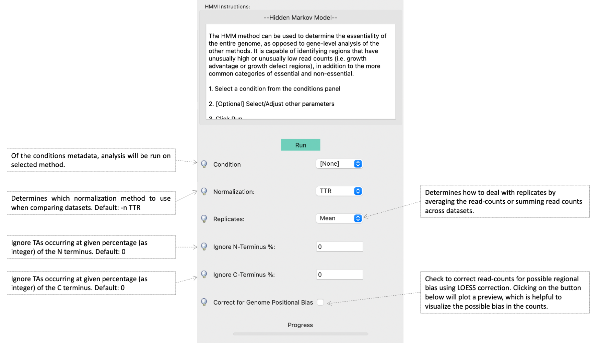
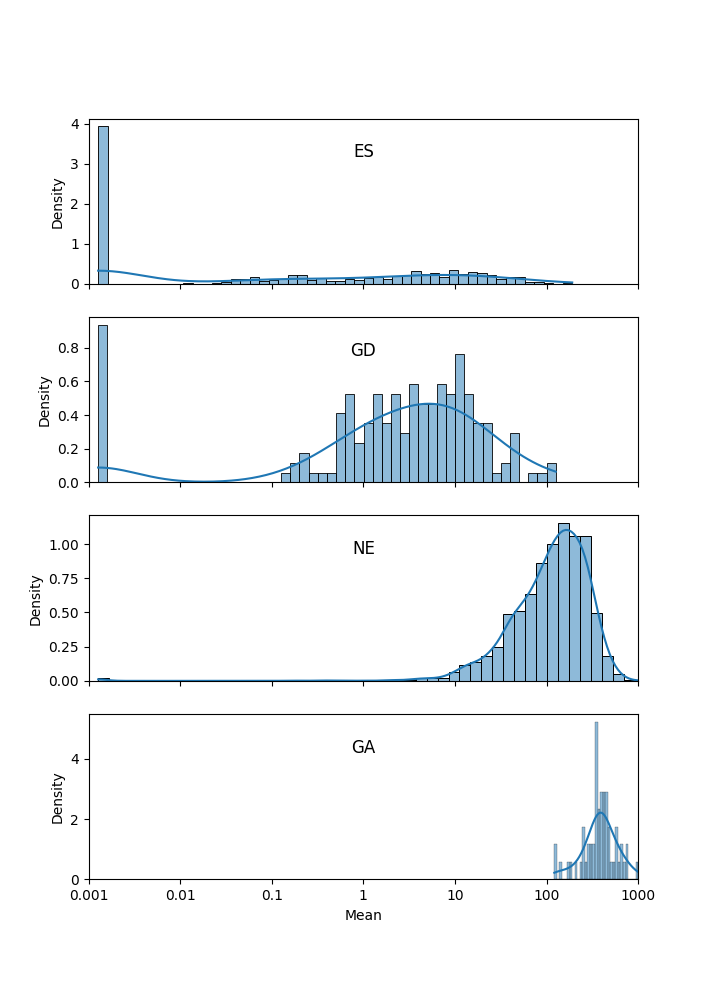

.. _HMM:

HMM
===

The HMM method can be used to determine the essentiality of the entire genome, as opposed to gene-level analysis of the other methods. It is capable of identifying regions that have unusually high or unusually low read counts (i.e. growth advantage or growth defect regions), in addition to the more common categories of essential and non-essential.

.. NOTE::
   Intended only for **Himar1** datasets.

|

How does it work?
-----------------

| For a formal description of how this method works, see our paper [DeJesus2013HMM]_:
|
|  DeJesus, M.A., Ioerger, T.R. `A Hidden Markov Model for identifying essential and growth-defect regions in bacterial genomes from transposon insertion sequencing data. <http://www.ncbi.nlm.nih.gov/pubmed/24103077>`_ *BMC Bioinformatics.* 2013. 14:303

The HMM method automatically estimates the necessary internal statistical
parameters from the datasets (adjusts for global saturation 
and read counts). 

Usage
-------

::

  > python3 transit.py hmm <combined_wig_file> <metadata_file> <annotation_file> <condition_to_analyze> <output_file> [Optional Arguments]
        Optional Arguments:
            --r <string>     :=  How to handle replicates. Sum, Mean. Default: --r Mean
            --n <string>     :=  Normalization method. Default: --n TTR
            -l               :=  Perform LOESS Correction; Helps remove possible genomic position bias. Default: Off.
            --iN <float>     :=  Ignore TAs occurring at given percentage (as integer) of the N terminus. Default: --iN 0
            --iC <float>     :=  Ignore TAs occurring at given percentage (as integer) of the C terminus. Default: --iC 0
            -conf-on         :=  enable additional columns with confidence information

Parameters
----------
You can change how the method handles
replicate datasets:

-  **Replicates:** Determines how the HMM deals with replicate datasets
   by either averaging the read-counts or summing read counts across
   datasets. For regular datasets (i.e. mean read-count > 100) the
   recommended setting is to average read-counts together. For sparse
   datasets, summing read-counts may produce more accurate results.
|

GUI Mode
--------
The HMM analysis method can be selected from the "Method" tab in the Menu Bar. 

|
The parameters to input through the parameter panel for the method is equivalent to the command line usage (see parameter descriptions above for full detail): 

The method is run using the combined wig, metadata, and annotation uploaded into TRANSIT.

Output and Diagnostics
----------------------

| 

The HMM method outputs two files. One with statistics for individual
TA sites (SITES), and one with summaries for genes (GENES).

.. NOTE::

  The primary output most users will want to look at is the 
  ESSENTIALITY CALLS in the GENES output file.

The first file (SITES) provides the most likely assignment of states
for all the TA sites in the genome. Sites can belong to one of the
following states: "E" (Essential), "GD" (Growth-Defect), "NE"
(Non-Essential), or "GA" (Growth-Advantage). In addition, the output
includes the probability of the particular site belonging to the given
state.  The columns of this file are defined as follows:

Sites Output File:
~~~~~~~~~~~~~~~~~~

+----------------+-----------------------------------------------------------------------------------------------------+
| Column Header  | Column Definition                                                                                   |
+================+=====================================================================================================+
| Location       | Coordinate of TA site                                                                               |
+----------------+-----------------------------------------------------------------------------------------------------+
| Read Count     | Observed Read Counts                                                                                |
+----------------+-----------------------------------------------------------------------------------------------------+
| Probability ES | Probability for ES state                                                                            |
+----------------+-----------------------------------------------------------------------------------------------------+
| Probability GD | Probability for GD state                                                                            |
+----------------+-----------------------------------------------------------------------------------------------------+
| Probability NE | Probability for NE state                                                                            |
+----------------+-----------------------------------------------------------------------------------------------------+
| Probability GA | Probability for GA state                                                                            |
+----------------+-----------------------------------------------------------------------------------------------------+
| State          | State Classification (ES = Essential, GD = Growth Defect, NE = Non-Essential, GA = Growth-Defect)   |
+----------------+-----------------------------------------------------------------------------------------------------+
| Gene           | Gene(s) that share(s) the TA site.                                                                  |
+----------------+-----------------------------------------------------------------------------------------------------+

|  The second file provides a gene-level classification for all the
  genes in the genome. Genes are classified as "E" (Essential), "GD"
  (Growth-Defect), "NE" (Non-Essential), or "GA" (Growth-Advantage)
  depending on the number of sites within the gene that belong to those
  states.

Genes Output File:
~~~~~~~~~~~~~~~~~~

+-------------------+-----------------------------------------------------------------------------------------------------+
| Column Header     | Column Definition                                                                                   |
+===================+=====================================================================================================+
| Orf               | Gene ID                                                                                             |
+-------------------+-----------------------------------------------------------------------------------------------------+
| Gene Name         | Gene Name                                                                                           |
+-------------------+-----------------------------------------------------------------------------------------------------+
| Description       | Gene Description                                                                                    |
+-------------------+-----------------------------------------------------------------------------------------------------+
| Total Sites       | Number of TA sites                                                                                  |
+-------------------+-----------------------------------------------------------------------------------------------------+
| ES Count          | Number of sites labeled ES (Essential)                                                              |
+-------------------+-----------------------------------------------------------------------------------------------------+
| GD Count          | Number of sites labeled GD (Growth-Defect)                                                          |
+-------------------+-----------------------------------------------------------------------------------------------------+
| NE Count          | Number of sites labeled NE (Non-Essential)                                                          |
+-------------------+-----------------------------------------------------------------------------------------------------+
| GA Count          | Number of sites labeled GA (Growth-Advantage)                                                       |
+-------------------+-----------------------------------------------------------------------------------------------------+
| Mean Insertions   | Mean insertion rate within the gene                                                                 |
+-------------------+-----------------------------------------------------------------------------------------------------+
| Mean Reads        | Mean read count within the gene                                                                     |
+-------------------+-----------------------------------------------------------------------------------------------------+
| State Call        | State Classification (ES = Essential, GD = Growth Defect, NE = Non-Essential, GA = Growth-Defect)   |
+-------------------+-----------------------------------------------------------------------------------------------------+

|
|  Note: Libraries that are too sparse (e.g. < 30%) or which contain
  very low read-counts may be problematic for the HMM method, causing it
  to label too many Growth-Defect genes.

|

Run-time
--------

| The HMM method takes less than 10 minutes to complete. The parameters
  of the method should not affect the running-time.

|

.. rst-class:: transit_sectionend
----

HMM Confidence Scores
---------------------

.. NOTE::
  * Confidence scoring appends 7 additional columns to the HMM genes output file.
  * In command-line mode, confidence scoring is turned OFF by default, but you can turn it on with the '-conf-on' flag.
  * In the GUI, you can toggle it on or off as desired.

One of the difficulties in assessing the certainties of the HMM calls
is that, while the formal state probabilities are calculated at
individual TA sites, the essentiality calls at the gene level are made
by taking a vote (the most frequent state among its TA sites), and
this does not lend itself to such formal certainty quantification.
However, we developed a novel
approach to evaluating the confidence of the HMM calls for genes.  
We have sometimes noticed that short genes are
susceptible to being influenced by the essentiality of an adjacent
region, which is evident by examining the insertion statistics
(saturation in gene, or percent of TA sites with insertion, and 
mean insertion count at those sites).  For
example, consider a hypothetical gene with just 2 TA sites that is
labeled as ES by the HMM but has insertions at both sites.  It might
be explained by proximity to a large essential gene or region, due to
the “smoothing” the HMM does across the sequence of TA sites.  Thus we
can sometimes recognize inaccurate calls by the HMM if the insertion
statistics of a gene are not consistent with the call
(i.e. a gene labeled as NE that has no insertions, or conversely,
a gene labeled ES that has many insertion).

In our paper on the HMM in Transit `(DeJesus et al, 2013)
<https://pubmed.ncbi.nlm.nih.gov/24103077/>`_, we showed a plot of
random samples from the joint posterior distribution of local
saturation and mean insertion counts (at non-zero sites) for the 4
essentiality states, which nicely demonstrates that that ES genes have
near-0 saturation and low counts at non-zero sites, NE genes have high
saturation and counts, GD genes fall in between, and GA genes are
almost fully saturated with excessively high counts.

Following this idea, we can use the
observed insertion counts in each gene to assess the 
confidence in each of the essentiality calls by the HMM.
Rather than modeling them as 2D distributions, we *combine* them into
1D (Gaussian) distributions over the *overall mean insertion count* in
each gene, including sites with zeros.  The mean count for essential
(ES) genes usually around 0, typically around 5-10 for growth-defect
(GD) genes, around 100 for non-essential (NE) genes, and >300 for
growth-advantaged (GA) genes (assuming TTR normalization, by default).

We now calculate these conditional distributions empirically for each
dataset on which the HMM is run, and use it to assess the confidence
in each of the essentiality calls.  We start by calculating the mean
and standard deviation of saturation and insertion count over all the
genes in each of the 4 states (ES, GD, NE, and GA).  The empirical
mean and standard deviation for each state are reported in the header
of the output file (by HMM_conf.py, see below).  Then, for each gene,
we compute the probability density (likelihood) of its mean count with
respect to the Normal distribution for each of the 4 states. For
example, suppose a gene g is called state s.  Then:

::

     P(g|s) = N(cnt(g)|μ_cnt(s), σ_cnt(s))

The 4 probabilities are normalized to sum up to 1.
The confidence in the HMM call for a gene is taken to be the normalized
probability of the called state.

This confidence score nicely identifies genes of low confidence, where
the local saturation and mean insertion count seem inconsistent with
the HMM call.  The low-confidence genes are biased toward short genes
(with 1-3 TA sites), though they include some large genes with many TA
sites as well.  Some of the former are cases where the call of a short
gene is influenced by an adjacent region.  Some of the latter include
ambiguous cases like multi-domain proteins, where one domain is
essential and the other is not.  We observed that there are often
“borderline” (or ambiguous) genes, where the 
called state has significant probability (>0.2), but is not the most
probable state (i.e. another state is more likely, based on the insertions in the gene).

Criteria (for gene g with called state c):
  * genes where the called state has the highest conditional probability (most likely, given their mean count) are 'confident'
  * genes where P(g|c)>0.2, but there is another state that has higher probability are 'ambiguous'
  * genes with P(g|c)<0.2 are 'low-confidence'

The 'low-confidence' and 'ambiguous' genes are now indicated in the
'flag' field added by HMM_conf.py in the output files (see below).

In genomes with thousands genes, it is not uncommon for there to be a
few hundred low-confidence and ambiguous genes each, depending on the
saturation of the input dataset (.wig file); less-saturated datasets
tend to have more low-confidence genes.

We implemented this procedure as a stand-alone **post-processing script**
(called '**HMM_conf.py**' in the src/ directory) which is run on HMM output files,
calculates a “confidence” score for each gene
and appends this information as extra columns to the HMM output file.
(In the future, it will be integrated directly into the HMM output,
obviating the need for a second step.)

::

  usage: python3 src/HMM_conf.py <HMM_output.genes.txt>

  example: 

  > python HMM_conf.py HMM_Ref_sync3_genes.txt > HMM_Ref_sync3_genes.conf.txt

The script adds the following columns:

 * **Mean** - the mean insertion count over *all* TA sites in the gene.
 * **consis** - consistency (proportion of TA sites representing the majority essentiality state)
  - If consistency<1.0, it means not all the TA sites in the gene agree with the essentiality call, which is made by majority vote. It is OK if a small fraction of TA sites in a gene are labeled otherwise. If it is a large fraction (consistency close to 50%), it might be a 'domain-essential' (multi-domain gene where one domain is ES and the other is NE). 
 * **probES** - conditional probability (normalized) of the mean insertion count if the gene were essential 
 * **probGD** - conditional probability (normalized) of the mean insertion count if the gene were growth-defect (i.e. disruption of gene causes a growth defect)
 * **probNE** - conditional probability (normalized) of the mean insertion count if the gene were non-essential 
 * **probGA** - conditional probability (normalized) of the mean insertion count if the gene were growth-advantaged
 * **conf** - confidence score (normalized conditional joint probability of the insertion statistics, given the actual essential call made by the HMM)
 * **flag** - genes that are ambiguous or have low confidence are labeled as such:
  - *low-confidence* means the proability of the HMM call is <0.2 based on the mean insertion counts in gene, so the HMM call should be ignored
  - *ambiguous* means the called state has prob>0.2, but there is another state with higher probability; these could be borderline cases where the gene could be in either category

Here is an example to show what the additional columns look like. 
The Mean insertion counts for the 4 essentiality states can be seen in the header.
Note that MAB_0008 was called GA, but only has insertions at 3 out of 4 TA sites
(sat=75%) with a mean count of only 118, so it is more consistent with NE; hence it is
flagged as low-confidence (and one should ignore the GA call).  GyrB was labeled as 'ambiguous'
because it was called ES, but it has a few insertions, making look partially like GD.

::

  #HMM_Genes
  #yaml:
  #    date: 2023-12-18 14:22:12
  #    transit_version: v1.0.7
  #    app_or_command_line: command_line
  #    console_command: python3 ../../transit2/src/transit.py hmm TnSeq-Ref-3.combined_wig.txt TnSeq-Ref-3.metadata.txt abscessus.prot_table Ref temp.txt -l -conf-on
  #    Summary Of Gene Calls:
  #       ES: 375
  #       GD: 134
  #       NE: 4241
  #       GA: 167
  #       N/A: 6
  #    Naming Reference:
  #       ES: essential
  #       GD: insertions cause growth-defect
  #       NE: non-essential
  #       GA: insertions confer growth-advantage
  #       N/A: not analyzed (genes with 0 TA sites)
  #    Confidence Summary:
  #       HMM confidence info:'
  #       avg gene-level consistency of HMM states: 0.9876
  #       state posterior probability distributions:
  #         Mean[ES]:   Norm(mean=0.57,stdev=5.9)
  #         Mean[GD]:   Norm(mean=3.77,stdev=6.47)
  #         Mean[NE]:   Norm(mean=111.95,stdev=96.55)
  #         Mean[GA]:   Norm(mean=393.64,stdev=171.84)
  #       num low-confidence genes: 580
  #       num ambiguous genes: 507
  #    
  #ORF      Gene  Description                        TAsites  EScount GDcount NEcount GAcount Saturation NZmean  Call Mean  Consis  ESpro b  GDprob   NEprob   GAprob   Conf   Flag
  MAB_0001  dnaA  Chromosomal replication initiator  26       26      0       0       0        0.0385    2.00    ES   0.1   1.0     0.552086 0.429238 0.017295 0.001381 0.5521 
  MAB_0002  dnaN  DNA polymerase III, beta subunit   18       17      0       1       0        0.1111    2.00    ES   0.2   0.944   0.549515 0.431896 0.017214 0.001374 0.5495      
  MAB_0003  gnD   6-phosphogluconate dehydrogenase   20        0      0       20      0        0.9500    58.42   NE   55.5  1.0     0.0      0.0      0.912267 0.087733 0.9123      
  MAB_0004  recF  DNA replication and repair protein 17        0      0       17      0        0.5294    133.33  NE   70.6  1.0     0.0      0.0      0.904815 0.095185 0.9048      
  MAB_0005  -     hypothetical protein                5        0      0       5       0        0.2000    175.00  NE   35.0  1.0     1e-06    0.000162 0.91944  0.080397 0.9194      
  MAB_0006  -     DNA gyrase (subunit B) GyrB        37       36      0       0       1        0.0270    130.00  ES   3.5   0.973   0.482594 0.498211 0.017769 0.001426 0.4826  ambiguous
  MAB_0007  -     Hypothetical protein               27        0      0       0       27       0.9259    333.76  GA   309.0 1.0     0.0      0.0      0.200118 0.799882 0.7999    
  MAB_0008  -     Hypothetical protein                4        0      0       0       4        0.7500    118.33  GA   88.7  1.0     0.0      0.0      0.892995 0.107005 0.107   low-confidence
  MAB_0009  -     Hypothetical protein                8        0      0       0       8        1.0000    308.62  GA   305.5 1.0     0.0      0.0      0.213811 0.786189 0.7862      
  MAB_0010c -     Hypothetical protein               16        0      0       0       16       0.9375    308.13  GA   288.9 1.0     0.0      0.0      0.285661 0.714339 0.7143      
  ...

.. rst-class:: transit_sectionend
----
