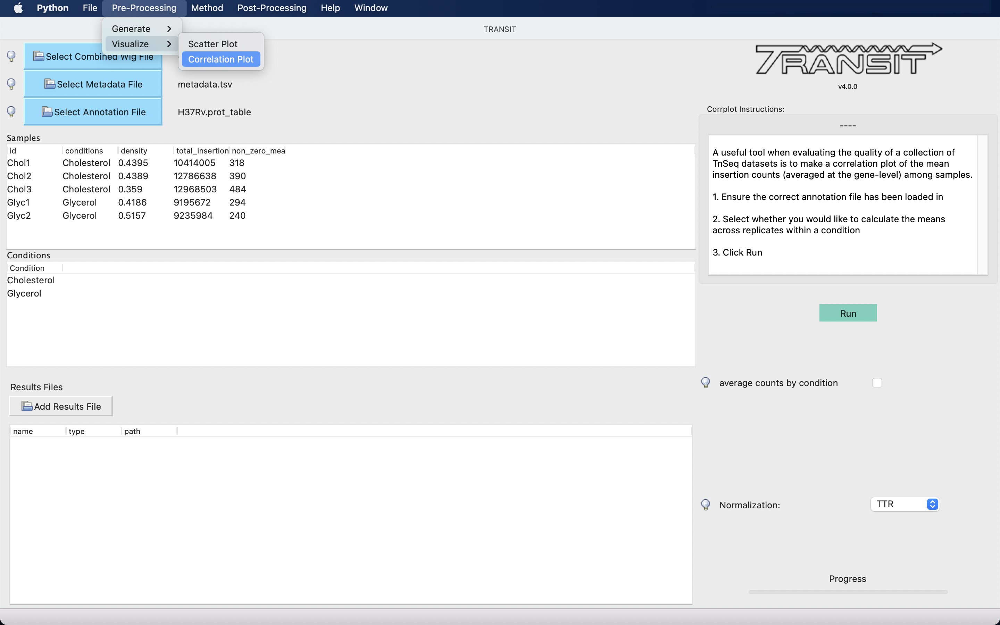
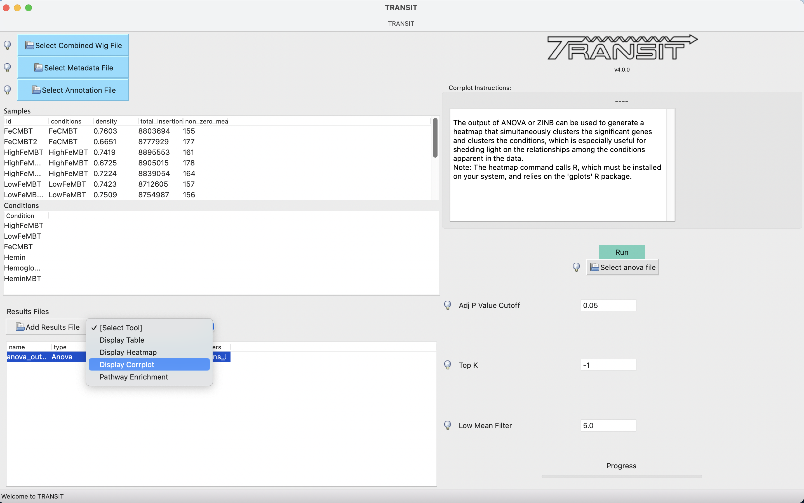

.. _corrplot:

corrplot
========

A useful tool when evaluating the quality of a collection of TnSeq datasets is to make a
*correlation plot* of the mean insertion counts (averaged at the gene-level) among samples.
While it is difficult to state unequivocally
how much correlation there should be between samples from different conditions
(or even between replicates of the same condition),
the corrplot can often reveal individual samples which stand out as being far less
correlated with all the others (which subsequently might be excluded from analyses).

NEW: how to select samples in CLI or GUI...

Command Line Usage
------

::

    > python3 transit.py  corrplot <combined_wig_file> <metadata_file> <annotation_file> <output.png>
    
    Optional parameters:
     --avg_by_conditions := groups by conditions, take the mean, then show correlation between conditions. Default: False

With the --avg_by_conditions flag, counts are averaged for each TA site across conditions and the corrplot is generated on those values.
Without the flag, a correaltion of the wig files is performed. 
# DOC NOTE : normalized before? 

Here is an example of making a corrplot:

::

  > python3 src/transit.py corrplot cholesterol_glycerol.transit/comwig.tsv cholesterol_glycerol.transit/metadata.tsv H37Rv.prot_table glyc_chol_corrplot.png
  correlations based on 3990 genes for each of the 5 wig files

.. image:: _images/glyc_chol_wigs_corrplot.png
   :width: 400
   :align: center

::

  > python3 src/transit.py corrplot cholesterol_glycerol.transit/comwig.tsv cholesterol_glycerol.transit/metadata.tsv H37Rv.prot_table glyc_chol_conditions_corrplot.png --avg_by_conditions
  correlations based on 3990 genes averaged across wigs for the 2 conditions 

.. image:: _images/glyc_chol_conditions_corrplot.png
   :width: 300
   :align: center
..
A corrplot can also be generated from the output of ANOVA or ZINB
analysis, showing relationships among the conditions themselves
(i.e. with replicates merged, rather than correlations among
individual samples).  Importantly, the correlations are based only on
the *subset* of genes identified as significantly varying (Padj <
0:05) in order to enhance the patterns, since otherwise they would be
washed out by the rest of the genes in the genome, the majority of
which usually do not exhibit significant variation in counts.

Here is an example which generates the following image showing the corrplot among
several different growth conditions:

::

  > python3 src/transit.py corrplot iron.transit/comwig.tsv iron.transit/metadata.tsv H37Rv.prot_table iron_anova.out iron_anova.out -anova --top_k 20
  correlations of counts on top 20 genes by adjusted p-value between across wigs grouped by conditions for results of ANOVA with no reference condition

.. image:: _images/anova_top20_corrplot.png
   :width: 400
   :align: center

::

GUI Mode
------
The Correlation Plot can be selected from the Visualize Option in the Pre-Processing Tab of the File Menu. The checkbox in the parameter panel is equivalent to the --avg_by_conditions flag. 
The combined_wig, metadata and annotation files used will be those uploaded into the application (see example below)

Generating a corrplot on the output of ANOVA or ZINB, can be selected "Post-Processing" tab in the Menu Bar or as an action on the ANOVA/ZINB output. If corrplot is run through results action on the ANOVA/ZINB
output, the corrplot is generated using the default parameters. If the corrplot action is selected from the Menu Bar, various parameters can be set.

The parameter panel is equivalent to the command line usage:

- **Select ANOVA|ZINB File**
    Select the output of the the selected method type. Ensure the correct file is selected. If the button reads "Select anova file",
    select an ANOVA output file and if the button reads "Select ZINB file", select an ZINB file as the input.

- **Adjusted P Value Cut-off**
    Qval threshold for selecting genes (default=0.05)

- **Top K**
    Select top k genes ranked by significance (default = -1; display all significant genes)

- **Low Mean Filter**
    Filter genes with grand mean count (across all conditions) below this threshold (even if qval<0.05); default is to exclude genes with mean count<5

.. rst-class:: transit_sectionend
----
