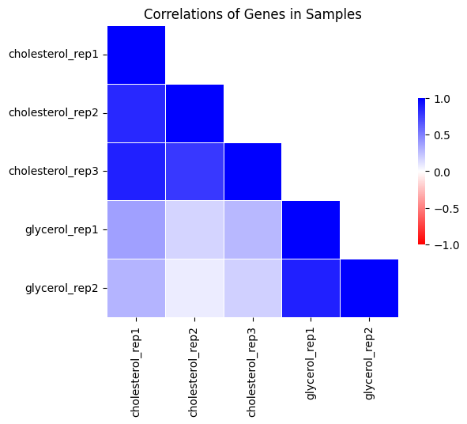
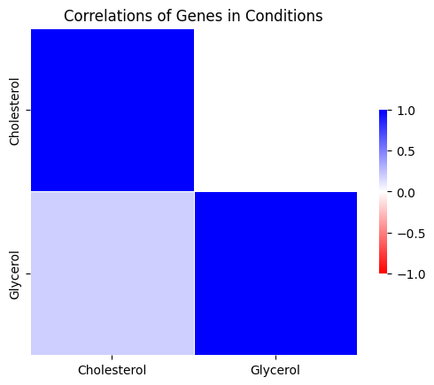

.. _corrplot:

corrplot
========

A useful tool when evaluating the quality of a collection of TnSeq datasets is to make a
*correlation plot* of the mean insertion counts (averaged at the gene-level) among samples.
While it is difficult to state unequivocally
how much correlation there should be between samples from different conditions
(or even between replicates of the same condition),
the corrplot can often reveal individual samples which stand out as being far less
correlated with all the others (which subsequently might be excluded from analyses).

NEW: how to select samples in CLI or GUI...

Command Line Usage:
------

::

    > python3 transit.py  corrplot <combined_wig_file> <metadata_file> <annotation_file> <output.png>
    
    Optional parameters:
     --avg_by_conditions := groups by conditions, take the mean, then show correlation between conditions. Default: False

With the --avg_by_conditions flag, counts are averaged for each TA site across conditions and the corrplot is generated on those values.
Without the flag, a correaltion of the wig files is performed. 
# DOC NOTE : normalized before? 

Here is an example of making a corrplot:

::

  > python3 src/transit.py corrplot cholesterol_glycerol.transit/comwig.tsv cholesterol_glycerol.transit/metadata.tsv H37Rv.prot_table glyc_chol_corrplot.png
  correlations based on 3990 genes for each of the 5 wig files

::

  > python3 src/transit.py corrplot cholesterol_glycerol.transit/comwig.tsv cholesterol_glycerol.transit/metadata.tsv H37Rv.prot_table glyc_chol_conditions_corrplot.png --avg_by_conditions
  correlations based on 3990 genes averaged across wigs for the 2 conditions 

# DOC NOTE : Corrplot does not run on ANOVA and ZINB outputs anymore right?

..
.. A corrplot can also be generated from the output of ANOVA or ZINB
.. analysis, showing relationships among the conditions themselves
.. (i.e. with replicates merged, rather than correlations among
.. individual samples).  Importantly, the correlations are based only on
.. the *subset* of genes identified as significantly varying (Padj <
.. 0:05) in order to enhance the patterns, since otherwise they would be
.. washed out by the rest of the genes in the genome, the majority of
.. which usually do not exhibit significant variation in counts.

.. Here is an example which generates the following image showing the corrplot among
.. several different growth conditions:

.. ::

..   > python3 src/transit.py corrplot anova_iron.txt iron_corrplot_anova.png -anova
..   correlations based on 229 genes

.. .. image:: _images/iron_corrplot_anova.png
..    :width: 300
..    :align: center

.. Note that if an ANOVA or ZINB output file (both of which contain mean
.. counts for each gene in each condition) is supplied in place of
.. mean_counts, the *last* argument of corrplot must be set to either
.. '-anova' or '-zinb' to indicate the type of file being provided as the
.. first argument.

.. Note: corrplot requires R (statistical analysis software)
.. to be installed on your system.  See :ref:`Installation Instructions <install-zinb>`.

GUI Mode:
------
The Correlation Plot can be selected from the Visualize Option in the Pre-Processing Tab of the File Menu. The checkbox in the parameter panel is equivalent to the --avg_by_conditions flag. 
The combined_wig, metadata and annotation files used will be those uploaded into the application (see example below)

.. image:: _images/corrplot_gui.png
   :width: 600
   :align: center

.. rst-class:: transit_sectionend
----
