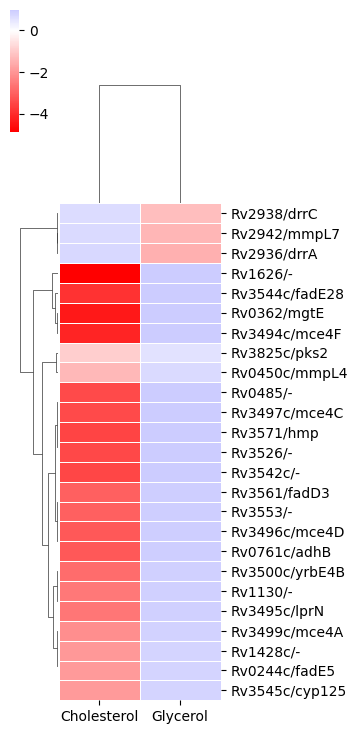
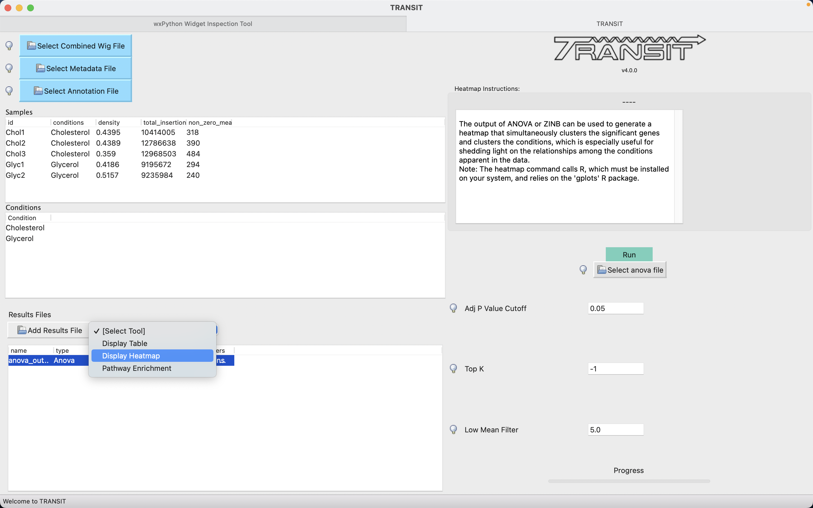
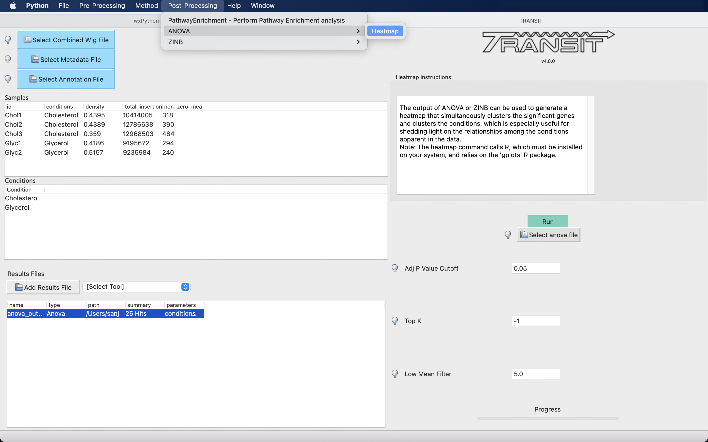

.. _heatmap:
heatmap
=======

The output of ANOVA or ZINB can be used to generate a heatmap that
simultaneously clusters the significant genes and clusters the conditions,
which is especially useful for shedding light on the relationships
among the conditions apparent in the data.

Command Line Usage:
------

::

  python3 src/transit.py heatmap <anova_or_zinb_output> <heatmap.png> -anova|-zinb [-topk <int>] [-qval <float] [-low_mean_filter <int>]

Note that the **third argument is required to be either '-anova' or '-zinb'**, 
which is a flag to indicate the type of file being provided as the second argument.

By default, genes are selected for the heatmap based on qval<0.05.
However, the user may change the selection of genes through 2 flags:

 * **-qval <float>**: change qval threshold for selecting genes (default=0.05)
 * **-topk <int>**: select top k genes ranked by significance (qval)
 * **-low_mean_filter <int>**: filter out genes with grand mean count (across all conditions) below this threshold (even if qval<0.05); default is to exclude genes with mean count<5

Here is an example which generates a heatmap of the results of ANOVA, where no reference condition was selected.

::

  > python3 src/transit.py heatmap anova_gly_chol.txt heatmap_gly_chol_anova.png -anova

Importantly, the heatmap is based only on the subset of genes
identified as *significantly varying* (Padj < 0:05, typically only a few
hundred genes) in order to enhance the patterns, since otherwise they would
be washed out by the rest of the genes in the genome, the majority of
which usually do not exhibit significant variation in counts.

GUI:
------
|
Heatmap can be accessed through the actions dropdown of an ANOVA or ZINB file in the results panel

When Display Heatmap is selected from the results action dropdown on a file, the heatmap function is run with default parameters.
A file dialog box appears to save the heatmap. The heatmap is added to the results area and shows up as pop-ups.

Heatmap can also be selected from the "Post-Processing" tab in the Menu Bar. 

When Heatmap is selected from the File Menu, the parameter panel is equivalent to the command line usage:

- **Select ANOVA|ZINB File**
    Select the output of the the selected method type. Ensure the correct file is selected. If the button reads "Select anova file",
    select an ANOVA output file and if the button reads "Select ZINB file", select an ZINB file as the input.

- **Adjusted P Value Cut-off**
    Qval threshold for selecting genes (default=0.05)

- **Top K**
    Select top k genes ranked by significance (default = -1; display all significant genes)

- **Low Mean Filter**
    Filter genes with grand mean count (across all conditions) below this threshold (even if qval<0.05); default is to exclude genes with mean count<5

.. rst-class:: transit_sectionend
----
