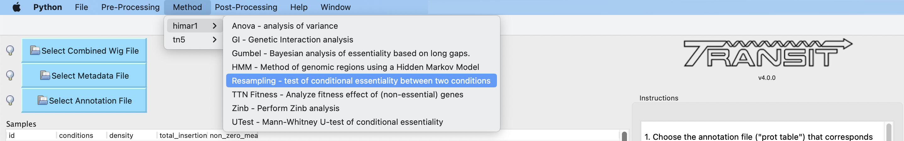
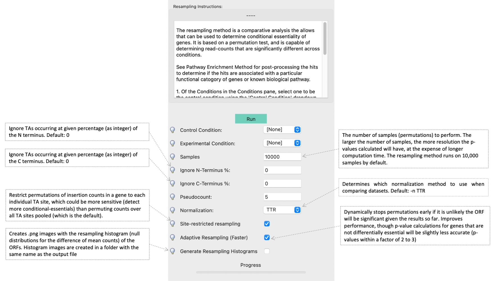

.. _resampling:

Resampling
==========

The resampling method is a comparative analysis the allows that can be
used to determine conditional essentiality of genes. It is based on a
permutation test, and is capable of determining read-counts that are
significantly different across conditions.

See :ref:`Pathway Enrichment Analysis <GSEA>` for post-processing the hits to
determine if the hits are associated with a particular functional catogory
of genes or known biological pathway.

.. .. NOTE::
..    Can be used for both **Himar1** and **Tn5** datasets

|
How does it work?
-----------------

This technique has yet to be formally published in the context of
differential essentiality analysis. Briefly, the read-counts at each
genes are determined for each replicate of each condition. The mean
read-count in condition A is subtracted from the mean read-count in
condition B, to obtain an observed difference in means. The TA
sites are then permuted for a given number of "samples". For each one of
these permutations, the difference in read-counts is determined. This
forms a null distribution, from which a p-value is calculated for the
original, observed difference in read-counts.

|

Site-Restricted (S-R) Resampling 
--------------------------------

The original version of resampling implemented in
Transit is called 'pooled' resampling because the counts are permuted
among all samples (replicates, conditions) *and* among all the TA
sites in a gene (i.e. randomizing counts within and between TA sites).
This was based on the assumption that insertions at any TA site are
equally likely (and the only differences are due to stochastic
differences in abundance in the transposon insertion library when
constructed).

We recently developed an improved version of resampling called
"site-restricted" (S-R) resampling.  With S-R resampling, during the
process of permuting the counts to generate the null distribution, the
counts at each TA site are restricted to permutations among samples
**within the same TA site** (the counts at each site are permuted
independently).  This restriction has the effect of reducing the
variance in the null distribution, because there is evidence that
there is an insertion bias for the Himar1 transposon that causes some
TA sites to have a higher propensity for insertions and hence higher
insertion counts than others (:ref:`Choudhery et al, 2021<Choudhery2021>`).

Testing on a wide range of TnSeq datasets suggests
that S-R resampling is **more sensitive** than regular pooled resampling.
Typically, S-R resampling finds 2-3 times as many significant conditionally essential
genes, mostly including the ones found by pooled resampling, but also capturing more 
borderline cases that were close to the previous significance cutoff.

It is important to note that the previous pooled version of resampling that has been
in Transit for many years is not wrong, just overly conservative.

S-R resampling is incorporated in the v3.2.7 version of Transit.
There is an option (i.e. checkbox) for it in the GUI interface
for the resampling method, and there is a new command-line flag (-sr) if you want 
use it in console mode.

History:

* The original form of resampling in Transit (for a long time) was 'pooled' resampling.
* Site-restricted resampling was introduced as an option (-sr) in v3.2.7 (9/21/22).
* As of Transit v4.0, site-restricted resampling is now the default.

Usage
-----

::

    Usage 1:
        > python3 src/transit.py  resampling <combined_wig_file> <metadata_file> <annotation_file> <ctrl_condition> <exp_condition> <output_file> [Optional Arguments]
          Note: The ctrl and exp condition names need to match Condition names in metadata_file

    Usage 2:
        > python3 src/transit.py  resampling <comma-separated .wig files (control group)> <comma-separated .wig files (experimental group)> <annotation_file> <output_file> [Optional Arguments]

    Optional Arguments:
        --s <integer>        :=  Number of samples. Default: --s 10000
        --n <string>         :=  Normalization method. Default: --n TTR
        -a                   :=  Perform adaptive resampling. Default: Turned Off.
        --PC <float>         :=  Pseudocounts used in calculating LFC. (default: 1)
        --iN <int>           :=  Ignore TAs occurring within given percentage (as integer) of the N terminus. Default: --iN 0
        --iC <int>           :=  Ignore TAs occurring within given percentage (as integer) of the C terminus. Default: --iC 0
        --ctrl_lib <string>  :=  String of letters representing library of control files in order
                                 e.g. 'AABB'. Default empty. Letters used must also be used in --exp_lib
                                 If non-empty, resampling will limit permutations to within-libraries.
        --exp_lib <string>   :=  String of letters representing library of experimental files in order
                                 e.g. 'ABAB'. Default empty. Letters used must also be used in --ctrl_lib
                                 If non-empty, resampling will limit permutations to within-libraries.
        -winz                :=  winsorize insertion counts for each gene in each condition 
                                (replace max cnt in each gene with 2nd highest; helps mitigate effect of outliers)
        -no-sr               :=  disable site-restricted resampling; less sensitive, might be more conservative for finding significant conditionally essential genes

Parameters
----------

The resampling method is non-parametric, and therefore does not require
any parameters governing the distributions or the model. The following
parameters are available for the method:

-  **Samples:** The number of samples (permutations) to perform. The
   larger the number of samples, the more resolution the p-values
   calculated will have, at the expense of longer computation time. The
   resampling method runs on 10,000 samples by default.

-  **Adaptive Resampling:** An optional "adaptive" version of resampling
   which accelerates the calculation by terminating early for genes
   which are likely not significant. This dramatically speeds up the
   computation at the cost of less accurate estimates for those genes
   that terminate early (i.e. deemed not significant). This option is
   OFF by default. (see Notes below)

-  **Include Zeros:** Select to include  sites that are zero. This is the
   preferred behavior, however, unselecting this (thus ignoring sites that)
   are zero accross all dataset (i.e. completely empty), is useful for
   decreasing running time (specially for large datasets like Tn5).

-  **Normalization Method:** Determines which normalization method to
   use when comparing datasets. Proper normalization is important as it
   ensures that other sources of variability are not mistakenly treated
   as real differences. See the :ref:`Normalization <normalization>` section for a description
   of normalization method available in TRANSIT.

-  **\-\-ctrl_lib, \-\-exp_lib:** These are for doing resampling with datasets from multiple libraries, see below.

-  **--iN, --iC:** Trimming of TA sites near N- and C-terminus.
   The default for trimming TA sites in the termini of ORFs is 0.
   However, TA sites in the stop codon (e.g. TAG) are automatically excluded.
   Trimming is specified as a percentage (as an integer), so, for example,
   if you want to trim TA sites within 5% of the termini, you would
   add the flags '--iN 5 --iC 5' (not 0.05).

-  **\-\-PC**: Pseudocounts used in calculation of LFCs (log-fold-changes, see Output and Diagnostics) in
   resampling output file.
   To suppress the appearance of artifacts due to high-magnitude of LFCs from
   genes with low insertion counts (which
   are more susceptible to noise), one can increase the pseudocounts using `--PC'.
   Increasing PC to a value like 5 (which is
   reasonable, given that TTR normalization scales data so average insertion counts is around 100)
   can further reduce the appearance of artifacts (genes with low counts but large LFCs).
   However, changing pseudocounts only affects the LFCs, and will not change the number of significant genes.

-  **-winz**: `winsorize <https://en.wikipedia.org/wiki/Winsorizing>`_ insertion counts for each gene in each condition. 
   Replace max count in each gene with 2nd highest.  This can help mitigate effect of outliers.

-  **-no-sr**: Turn off site based resampling. It makes the method less sensitive, reporting less significantly conditionally essential genes. 
   It also the user to permute counts over all TA sites pooled rather than restrict permutations of insertion counts in a gene to each individual TA site

|

Notes
-----
.. NOTE::
    I recommend using **-a (adaptive resampling)**. It runs much faster, and the p-values
    will be very close to a full non-adaptive run (all 10,000 samples).

Occasionally, people ask if resampling can be done on intergenic regions as well.
It could be done pretty easily (for example by making a prot_table with coordinates
for the regions between genes).  But it is usually not worthwhile, because most
intergenic regions are small (<100 bp) contain very few TA sites (often 0-2),
making it difficult to make confident calls on essentiality.

Command Line Examples
-----------------------------------------

Resampling can also now take a combined_wig_ file as input (containing insertion counts
for multiple sample), along with a samples_metadata_ file
that describes the samples. 
If you want to compare more than two conditions, see :ref:`ZINB <zinb>`.

Run Resampling with a Combined Wig File:
::
  > python3 transit.py resampling antibiotic_combined_wig.txt antibiotic_samples_metadata.txt Untreated Isoniazid H37Rv.prot_table results.txt -a

Run Resampling with Individual Wig Files:
::
  > python3 transit.py resampling glycerol_rep1.txt,glycerol_rep2.txt cholesterol_rep1.txt,cholesterol_rep2.txt H37Rv.prot_table results.txt -a

Doing resampling with datasets from different libraries 
--------------------------------------------------------

.. NOTE::
    **Currently supported only in Transit1** (This is Transit2)

In most cases, comparisons are done among samples (replicates) from
the same library evaluated in two different conditions.  But if the
samples themselves come from different libraries, then this could
introduce extra variability, the way resampling is normally done.  To
compensate for this, if you specify which libraries each dataset comes
from, the permutations will be restricted to permuting counts only
among samples within each library.  Statistical significance is still
determined from all the data in the end (by comparing the obversed
difference of means between the two conditions to a null distribution).
Of course, this method makes most sense when you have at least 1 replicate
from each library in each condition.

|

Doing resampling between different strains
------------------------------------------

.. NOTE::
    **Currently supported only in TRANSIT 3.2.X**

The most common case is that resampling is done among replicates all
from the same Tn library, and hence all the datasets (fastq files) are
mapped to the same refence genome.  Occasionally, it is useful to
compare TnSeq datasets between two different strains, such as a
reference strain and a clinical isolate from a different lineage.
Suppose for simplicity that you want to compare one replicate from
strain A (e.g. H37Rv) and one replicate from strain B (e.g. CDC1551).
Resampling was not originally designed to handle this case.  The
problem is that the TA sites in the .wig files with insertion counts
might have different coordinates (because of shifts due to indels
between the genomes).  Furthermore, a given gene might not even have
the same number of TA sites in the two strains (due to SNPs).  A
simplistic solution is to just map both datasets to the same genome
sequence (say H37Rv, for example).  Then a resampling comparison could
be run as usual, because the TA sites would all be on the same
coordinate system. This is not ideal, however, because some reads of
strain B might not map properly to genome A due to SNPs or indels
between the genomes.  In fact, in more divergent organisms with higher
genetic diversity, this can cause entire regions to look artificially
essential, because reads fail to map in genes with a large number of
SNPs, resulting in the apparent absence of transposon insertions.

A better approach is to map each library to the custom genome sequence
of its own strain (using TPP).  It turns out the resampling can still
be applied (since it is fundamentally a test on the difference of the
*mean* insertion count in each gene).  The key to making this work,
aside from mapping each library to its own genome sequence, is that
you need an annotation (prot_table) for the second strain that has
been "adapted" from the first strain.  This is because,
to do a comparison between conditions for a gene, Transit needs to be
able to determine which TA sites fall in that gene for each strain.
This can be achieved by producing a "modified" prot_table, where the
START and END coordinates of each ORF in strain B have been adjusted
according to an alignment between genome A and genome B. (If you need
help with this step, contact: ioerger@cs.tamu.edu).  In other words, the
app allows you to create 'B.prot_table' from 'A.prot_table' (and 'A.fna'
and 'B.fna').

Once you have created B.prot_table, all you need to do is provide
*both* prot_tables to resampling (either through the GUI, or on the
command-line), as a comma-separated list.  For example:

::

  > python3 transit.py resampling Rv_1_H37Rv.wig,Rv_2_H37Rv.wig 632_1_632WGS.wig,632_2_632WGS.wig H37Rv.prot_table,632WGS.prot_table resampling_output.txt -a

In this example, 2 replicates from H37Rv (which had been mapped to
H37Rv.fna by TPP) were compared to 2 replicates from strain 632 (which
had been mapped to 632WGS.fna, the custom genome seq for strain 632).
The important point is that **two annotations** are given in the 3rd
arg on the command-line: **H37Rv.prot_table,632WGS.prot_table**.  The
assumption is that the ORF boundaries for H37Rv will be used to find
TA sites in Rv_1_H37Rv.wig and Rv_2_H37Rv.wig, and the ORF boundaries
in 632WGS.prot_table (which had been adapted from H37Rv.prot_table
using the web app above) will be used to find TA sites in the
corrsponding regions in 632_1_632WGS.wig and 632_2_632WGS.wig.

Note that, in contrast to handling datasets from different libraries
disucssed above, in this case, the assumption is that all replicates
in condition A will be from one library (and one strain), and all
replicates in condition B will be from another library (another strain).

GUI Mode
-------
The resampling analysis method can be selected from the "Method" tab in the Menu Bar. 

|
The parameters to input through the parameter panel for the method is equivalent to the command line usage (see parameter descriptions above for full detail): 

   
|

Output and Diagnostics
----------------------

The resampling method outputs a tab-delimited file with results for each
gene in the genome. P-values are adjusted for multiple comparisons using
the Benjamini-Hochberg procedure (called "q-values" or "p-adj."). A
typical threshold for conditional essentiality on is q-value < 0.05.

+-----------------+-----------------------------------------------------------------+
| Column Header   | Column Definition                                               |
+=================+=================================================================+
| ORF             | Gene ID.                                                        |
+-----------------+-----------------------------------------------------------------+
| Gene Name       | Name of the gene.                                               |
+-----------------+-----------------------------------------------------------------+
| Description     | Gene description.                                               |
+-----------------+-----------------------------------------------------------------+
| Sites           | Number of TA sites in the gene.                                 |
+-----------------+-----------------------------------------------------------------+
| Mean Ctrl       | Mean of read counts in condition 1. (avg over TA sites and reps)|
+-----------------+-----------------------------------------------------------------+
| Mean Exp        | Mean of read counts in condition 2.                             |
+-----------------+-----------------------------------------------------------------+
| Log 2 FC        | Log-fold-change of exp (treatment) over ctrl (untreated)        |
+-----------------+-----------------------------------------------------------------+
| Sum Ctrl        | Sum of read counts in condition 1.                              |
+-----------------+-----------------------------------------------------------------+
| Sum Exp         | Sum of read counts in condition 2.                              |
+-----------------+-----------------------------------------------------------------+
| Delta Mean      | Difference in the MEAN insertion counts.                        |
+-----------------+-----------------------------------------------------------------+
| P Value         | P-value calculated by the permutation test.                     |
+-----------------+-----------------------------------------------------------------+
| Adj P Value     | Adjusted p-value controlling for the FDR (Benjamini-Hochberg)   |
+-----------------+-----------------------------------------------------------------+

**log2FC:** (log-fold-change, LFC)
For each gene, the LFC is calculated as the log-base-2 of the
ratio of mean insertion counts in the experimental (treated) condition vs. the
control condition (untreated, reference).
The default is PC=1, which avoids the result being undefined
for genes with means of 0 in either condition.  Pseudocounts can be
changed using the -PC flag (above).

::

  LFC = log2((mean_insertions_in_exp + PC)/(mean_insertions_in_ctrl + PC))

|

Run-time
--------

A typical run of the resampling method with 10,000 samples will take
around 45 minutes (with the histogram option ON [GUI only]). Using the *adaptive
resampling* option (-a), the run-time is reduced to around 10 minutes.

|

.. rst-class:: transit_sectionend
----
