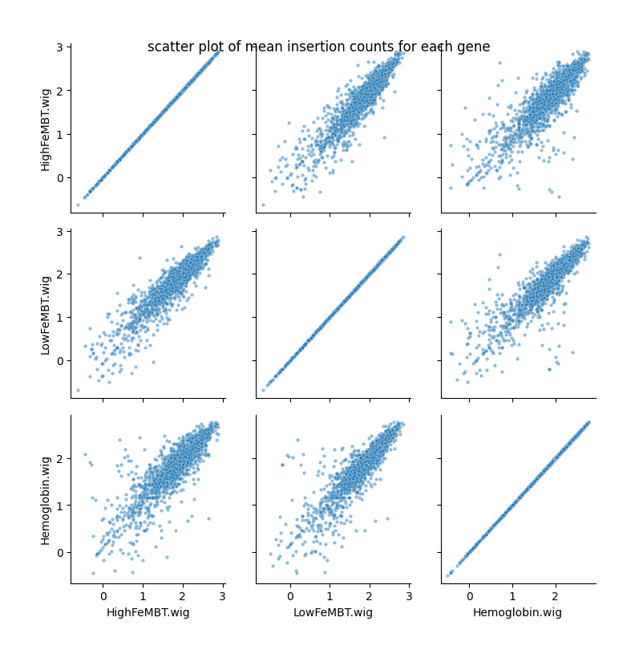
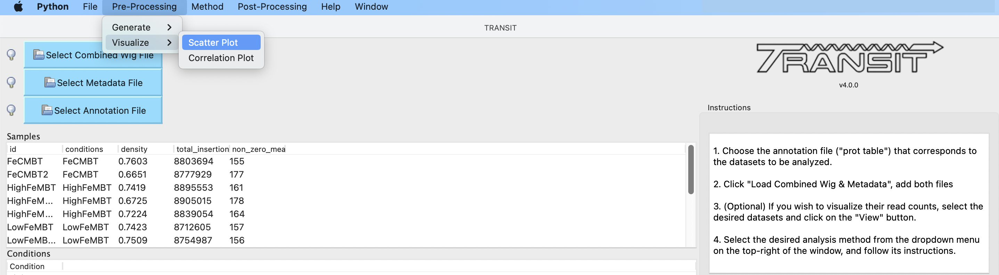
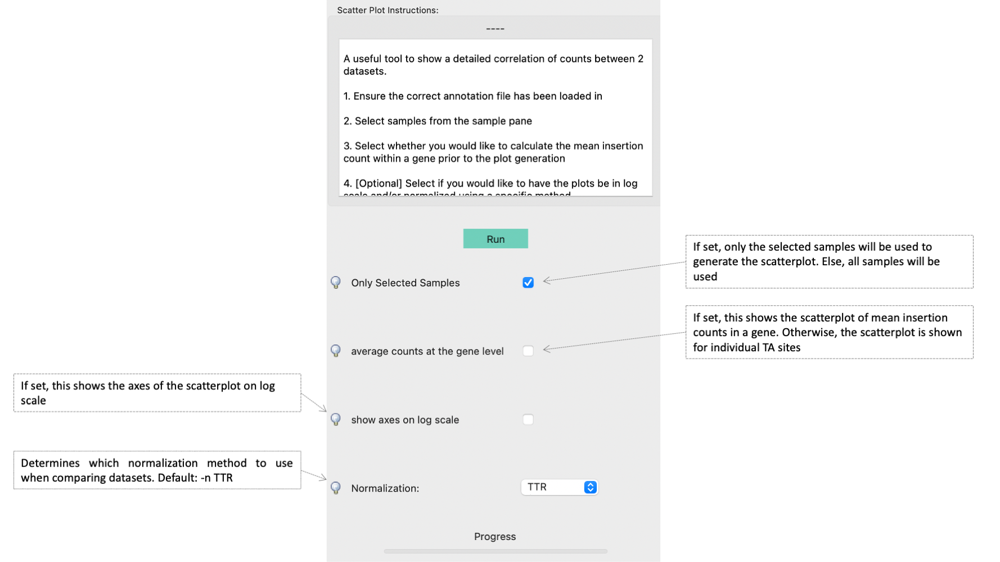

.. _scatterplot:

Scatterplot
===========

A useful tool when evaluating the quality of a collection of TnSeq datasets is to make a
*scatter plot* of the insertion counts (option to average at the gene-level) among samples.
The scatterplot can often reveal pairs of samples which stand out as being far less
correlated with all the others to TA sites causing skew (which subsequently might be excluded from analyses).

Command Line Usage
------
::

   > python3 ../../Projects/transit/src/transit.py  scatterplot <combined_wig_file> <metadata_file> <annotation_file> --samp <comma-separated sample IDs> <output.png> [Optional Arguments]

   Optional Arguments:
   -genes      := If set, this shows the scatterplot of mean insertion counts in a gene. Otherwise, the scatterplot is shown for individual TA sites
   -log        := If set, this shows the axes of the scatterplot on log scale

Example Usage
------
This scatterplot below was generated using the iron dataset for three individual samples, averaged by gene. Generally, each sample shows a linear relationship with the other two. 
The HighFeMBT sample shows a greater correlation with the LowFeMBT sample than the Hemoglobin sample.
::
    > python3 transit.py scatterplot iron.combined_wig.txt iron.metadata.txt H37Rv3.prot_table  --samp  HighFeMBT,LowFeMBT,Hemoglobin ./result_scatter.png -genes
.. image:: _images/iron_scatterplot.png
   :width: 500
   :align: center
|

The scatter plot with the same set of samples as above, averaged by genes, but with axes in log scale can be seen below. 
::
    > python3 transit.py scatterplot iron.combined_wig.txt iron.metadata.txt H37Rv3.prot_table  --samp  HighFeMBT,LowFeMBT,Hemoglobin ./result_scatter.png -genes -log

If distribution of counts is skewed, the relationship between samples might be easier to see on a log scale. However, it can exaggerate differences amoung low counts.

GUI Mode
------
The Scatterplot Plot can be selected from the Visualize Option in the Pre-Processing Tab of the File Menu. If the user wants to make a scatteplot on a subset of the samples, the samples are selected from the samples panel and the 
checkbox for "Only Selected Samples" clicked in the parameter panel (see below). All samples will be used by default.

The parameter panels is equivalent to their relative command line usage: 

The combined_wig, metadata and annotation files used will be those uploaded into the application

Runtime
------
This should be relatively fast, takes ~1 minute for to make scatterplots for all samples in the iron dataset

.. rst-class:: transit_sectionend
----
