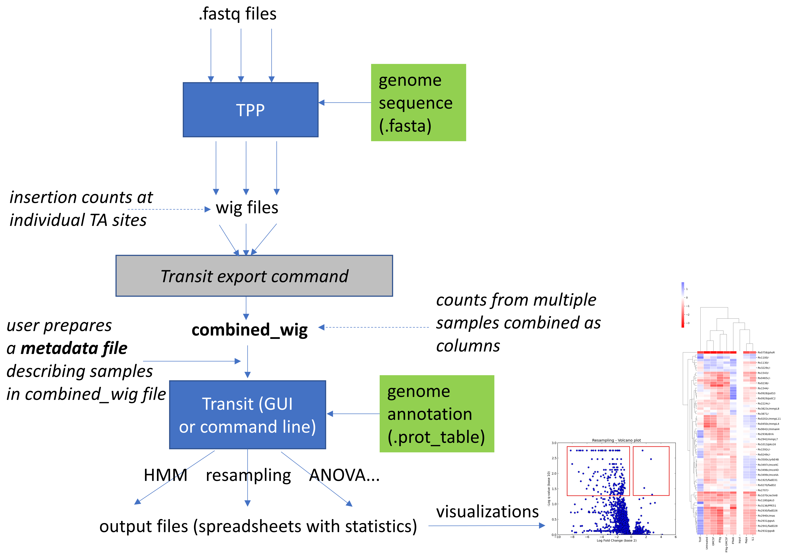
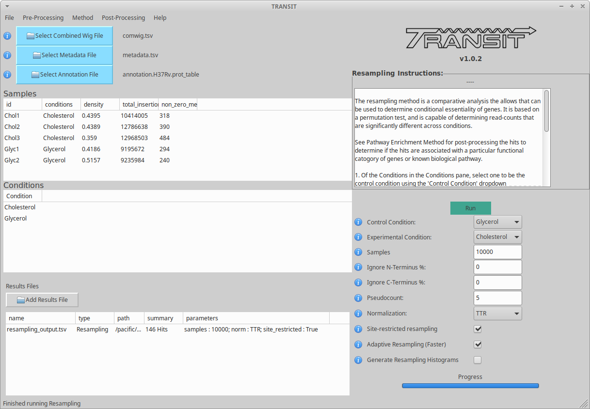

TRANSIT2 Overview
=================

Transit2 is a python-based software system that combines statistical
algorithms for analyzing TnSeq data (from sequencing transposon-mutant
libraries).  It has GUI (graphical-user interface) to make it easy for
users to process their data, conduct essentiality analyses, and visualize results.
Transit routines can also be run from the command line.  It works in
Linux, MacOS, and Windows.  Transit requires various python
packages to be installed, as well as R (a statistical program that Transit calls for
some analyses).

Transit2 has two main phases: 

 * a **pre-processing phase** (called TPP) which analyzes raw sequencing data (fastq files) and extracts transposon insertion counts at genomic coordinates (i.e. TA dinucleotides, for the Himar1 transposon), and   

 * **statistical analysis methods** (using Transit GUI or command line) - gumbel, HMM, resampling, ANOVA...

The statistical analyses are focused on identifying genes
that are *essential* or *conditionally-essential*, and quantifying the
statistical significance of these.  Although Transit is primarily
designed for Himar1 transposon libraries, some of the methods can also
be applied to other transposons, like Tn5.

**NEW in Transit2:**
The GUI and command-line versions of Transit have been 
overhauled to now take **combined_wig** files (and corresponding **metadata** files),
instead of individual .wig files.
Thus, after running TPP on all the individual samples,
the multiple .wig file are combined together in a single combined_wig file
with multiple columns.  This makes it much more convenient to 
manage and analyze large datasets.

Transit2 represents a complete overhaul of the software and GUI interface.
The commands and flags have changed, and the python API (internal data structures
and functions) have changed substantially.  The new GUI is more integrated for ease-of-use,
has some new features (like ANOVA and ZINB), and will make it easier to add new features
in the future.

.. Note::

  For previous users of Transit who prefer backwards compatibility,
  we will continue to maintain the original version of Transit (Transit1). 
  See the `documentation and installation instructions <https://transit.readthedocs.io/en/latest/transit_overview.html>`_

Typical Workflow
----------------

A typical workflow follows 3 phases, illustrated below.

1. **First**, the user runs TPP on raw sequence files (.fastq) to produce .wig files with insertion counts at coordinates of TA sites for each sample.
2. **Second**, the user runs a command to merge the .wig files into a single combined_wig file, and prepares a corresponding metadata file describing the samples.
3. **Third**, the user runs various statistical analysis methods in Transit, using the combined_wig and metadata files as inputs.

.. NOTE::
    Sequencing Recommendations
        1. Read Length: at least 75 x 75 bp paired-end reads 
        2. Sequencing Depth: 5-10 million reads per sample (for *M. tuberculosis* libraries) to get sufficient dynamic range of counts 
        3. Ideally, 3 replicates per condition
        
Most of the analyses in Transit produce an **output file in tab-separated format that can be 
opened as a spreadsheet**.  For example, 'resampling' generates an output file
that lists the data (mean insertion counts in 2 conditions being compared) and statistics (log-fold-change, p-value, adjusted p-value)
for each gene in the genome.  The user can then view this output file (in the GUI, or open it in a program like Excel)
to examine genes predicted to be conditionally essential.

TPP (Transit Pre-Processor)
---------------------------

TPP is a tool for analyzing raw sequencing data (.fastq files)
and tabulating insertion counts at TA sites.
TPP generates .wig files as output, which 
simply contain a pair of columns: 1) coordinates of TA sites,
and 2) counts of insertions observed at each site.

If Himar1 Tn libraries are prepared according to standard protocols,
such as `(Long et al. 2015) <https://pubmed.ncbi.nlm.nih.gov/25636614/>`_, 
then the sequencing reads will have a prefix
correspond to the transposon terminus, followed by genomic DNA (along with template barcodes in read 2).

TPP removes the prefix and maps the genomic portion of the read into
the genome (using BWA, `Li and Durbin, 2009 <https://pubmed.ncbi.nlm.nih.gov/19451168/>`_).  
It also reduces counts to unqiue
templates at each site, which reduces noise.

For diagnostics, each TPP run also generates a .tnseq_stats output file
which contains various metrics, such as the density (percent of TA sites
with insertions), total reads, mapped reads, and the NZmean (mean counts at non-zero sites).
It also reports statistics on how many reads were rejected because they contained
primer, adapter, or vectors sequences, which can be useful for diagnosing problems with the library.

For Tn5 datasets (e.g. generated the MmeI restriction enzyme, 
`van Opijnen et al. (2015) <https://www.ncbi.nlm.nih.gov/pmc/articles/PMC4696536/>`_), 
the differences in running TPP are: 
1) there is no prefix, since the transposon terminus does not appear in the reads, 
and 2) the .wig files contain coordinates and counts for all sites in the 
genome, since Tn5 is not restricted to insertions at TA sites (unlike Himar1).

Combined_wig and Metadata Files
-------------------------------

Once the .wig files are created, they are combined into a :ref:`combined_wig <combined_wig_link>`
file.  This is a new step in Transit2.  Multiple .wig files are
combined into a single combined_wig file using the **'transit export
combined_wig'** command on the command line.  Users then prepare a
:ref:`metadata <metadata_files>` file describing each of the samples (as a spreadsheet,
e.g. in Excel, which is then saved in tab-separted format).  Most
commonly, there will be several replicates associated with
each condition.  The analysis methods in Transit all have been redesigned
to take combined_wig and metadata files as inputs, which simplifies
things when working with large datasets.

By default, the insertion counts in each dataset (.wig file) are **normalized**
by TTR (Total Trimmed Read-count) when they are combined in a combined_wig file.
This facilitates comparing insertion counts at individaul TA sites across samples.
If alternative normalization (or none) is desired, this can be specified
using a flag in the 'export combined_wig' command.

It is often useful to *examine at the pattern of insertions in conditionally-essential genes
in combined_wig files* to confirm what the statistical analyses label as "significant" genes,
e.g. to ensure that the result is not biased by outliers (high counts) at individual sites,
but rather that apparent differences in counts between conditions are reflected as a consistent trend
over multiple TA sites in a gene.  *This is a recommended practice.*

Once a combined_wig file is prepared, it can be used to
:ref:`assess data quality <transit_quality_control>`. There are two methods
available.  First, there is a :ref:`tnseq_stats <tnseq_stats>` command, which will
calculate various metrics for each sample, include saturation
(density, percent of TA sites with non-zero insertions), mean read
count (NZmean), as well as skewness and other statistics of the
read-count distribution (for diagnostic purposes).  This can be run at
the command-line and in the GUI. Also, plots of read-count
distributions can be generated for selected samples in the GUI (again,
helpful for identifying highly skewed samples).  A discussion about
skewed samples, the problems they cause, and what to do about them can be
found :ref:`here <transit_quality_control>` (Quality Control).

One can also evaluate and compare samples by making :ref:`scatter plots <scatterplot>` and pairwise :ref:`correlation plots <corrplot>`,
to get a preview of how samples are related to each other.

Genome Annotations (.prot_tables and .gff files)
------------------

The annotation of a genome contains information about genes, such as
coordinates, strand, locus tag, gene name, and functional description.
Transit uses a custom format for annotations called prot_tables,
e.g. H37Rv.prot_table.  :ref:`Prot_tables <annotation_files>` are **tab-separated text files**
containing the information on each gene, such as coordinates, strand, ORF id, and gene name.

In many cases, users might often obtain annotations for their genome
in .gff (or .gff3) file format, such as downloaded from NCBI.  .gff
files contains essentially the same information about genes.  However,
there is a bit more flexibility in the .gff file format (especially in
the tags used in the right-most column), and the information about
genes is not always encoded in a uniform way, making it difficult to
use arbitrary .gffs for analyses in Transit.  Therefore, there is a
simple procedure in Transit to convert a .gff file to .prot_table
format (see 
:ref:`instructions for converting .gff files to .prot_tables <annotation_files>`).  
This step only has to be done once, and then the .prot_table can be used
for all subsequent analyses in Transit.

GUI
---

Here is a screenshot of the new GUI in Transit2:

Basic walk-through:

* You start by **loading 3 input files** (in succession): combined_wig, metadata, and annotation. This will populate the upper panel with individual samples, and the middle panel with conditions.

* Next, you can evaluate certain samples by selecting them and then choose an Action from the 'Select Tool' dropdown box above the samples panel, such as displaying track views, making scatter plots, examining chromosomal bias via LOESS plots, and showing plots of read-count distributions (for quality control).

* Next, you can select an analysis method from the menu (under **Methods->himar1**), such as gumbel, HMM, resampling, ZINB...  This will bring up a corresponding **parameter panel** on the right.  You might need to select specific samples or conditions to analyze. You can usually use the defaults for the other parameters. 

* Then you hit the **Run button**. You should be able to monitor progress via the Progress Bar.

* Status updates and various messages will be displayed in the **Message Bar** at the bottom of the GUI window. Important: The full list of messages, including error messages will be printed on in the console window from where you started Transit. Check these message if anything goes wrong.

* Usually, an analysis method will generate one or more output files.  These are typically text files in tab-separated format (which could be opened as spreadsheets in Excel). The file will get populated into the **Results Table** (bottom pannel).

* If you select an output file in the panel, it will provide a dropdown with Actions you can perform, including  displaying the file as a table (or figure, if it is an image, such as volcano plots, heatmaps, etc). Some output files have customized Actions, such as making a volcano plot from output of resampling, or making a heatmap from the output file after running ANOVA or ZINB.

* One of the most common and important Actions ('Select Tool' dropdown under Results Files) is to perform is **Pathway Enrichment Analysis** on the genes found to be significant by one of the other analyses (e.g. gumbel, hmm, resampling, ANOVA). Most of these output files have a column with adjusted P-values, and significant "hits" are usually defined as genes with Padj<0.05.  If you have more than about 20 hits, you can use Pathway Enrichment Analysis to determine whether they share functional similarities.  There are several systems of pathways available, including COG categories and GO terms.

Pre-Processing Tasks
--------------------

When you first start the Transit GUI, you load up your TnSeq dataset (combined_wig file).
Before running any statistical analyses, the first thing you will probably want to
do is explore the individual samples, their relationships, and data quality.
Most of these steps can be performed by clicking on a sample in the samples menu
and selecting an action from the drop-down list, or by choosing one of the items from
the Pre-Processing menu.  These steps can also be done at the command line.

 * generate a :ref:`tnseq_stats <tnseq_stats>` table (under Pre-Processing menu) summaring key statistics and metrics for each individual sample (including saturation, skewness, etc)

 * generate a **LOESS plot** (drop-down list) to see whether the mean read count variest significantly across the genome (chromosomal position bias; M. tuberculosis samples typically do not show a substantial bias)

 * examine **distributions of read-counts and QQ-plots** (select 'Quality Control' in drop-down list) to check for highly skewed samples 

 * look at a **Track View** (drop-down list) for one or more samples that shows insertions (vertical bars) at TA sites in a target gene or locus

 * compute a :ref:`gene means <gene_means>` spreadsheet, with the mean insertion count in each gene in each condition (Pre-Processing->Gene Means) - this generates a helpful spreadsheet from which one can make barcharts showing how the (normalized) insertion counts vary across conditions for genes of interest

 * :ref:`normalize <normalization>` counts in a combined_wig file (Pre-Processing->Normalize) - while most of the analysis methods automatically perform TTR normalization, and even the method for creating combined_wig files normalizes by default, one can choose to normalize a sample or whole dataset a different way (such as the Beta-Geometric Correction, BGC).  But in most cases, users will not need to do an explicit normalization step.
 
 * make a :ref:`scatter plot <scatterplot>` (Pre-Processing->Visuals->scatterplot) between 2 samples showing how correlated the mean insertion counts are at the gene level to check for consistency/reproducibility

 * make a :ref:`correlation plot <corrplot>` (Pre-Processing->Visuals->corrplot) among all samples to see which conditions appear more similar to each other, and to check that replicates are most highly correlated with each other (or check for outlier samples that do not correlate well with other replicates of the same condition, which might suggest they are bad or noisy)

Statistical Analysis Methods
----------------------------

The analysis methods available in Transit are divided into 3 categories:

* Methods for analyzing **single conditions** or datasets and identifying *essential genes*

  * :ref:`Gumbel method <gumbel>` - looks for genes with larges 'gaps', or consecutive sequences of TA sites without insertions

  * :ref:`Hidden Markov Model <HMM>` (HMM) - assigns genes to one of 4 states: ES (essential), GD (growth-defect), NE (non-essential), or GA (growth-advantaged), based on magnitudes of insertion counts (reflecting fitness effects of mutants)

* Methods for **pairwise comparisons of datasets** (e.g. between a treatment and control condition) to identify *conditionally essential genes*

  * :ref:`resampling` - a non-parametric test using permutations of insertion counts to simulate a null distribution of difference in mean counts for each gene

  * :ref:`Mann-Whiney U-test <Utest>` - another non-parametric test based on comparison of rank-ordering of insertion counts in each gene

* Methods for analyzing **multiple conditions** (>=2) to identify genes which exhibit *significant variability* of insertion counts across conditions 

  * :ref:`ANOVA`

  * :ref:`ZINB` - similar to ANOVA, but uses the Zero-Inflated Negative Binomial disribution to model counts; this method has options for testing for *interactions among covariates*

  * :ref:`Genetic Interaction <genetic-interactions>` analysis - this is a special case customized for testing interactions between 2 variables in a 2x2 experimental design (4 conditions)

Analyses for Tn5 Datasets
-------------------------

Although Transit was originally designed for analyzing Himar1 TnSeq datasets,
many of the methods can be adapted for analyzing datasets that use other transposons like Tn5.
The main difference is that the Himar1 transposon is restricted to insertions at 
TA dinucleotide sites, whereas Tn5 is capable of inserting more broadly at any coordinate
in the genome.

**1/3/2023:** Previously (in Transit1 versions up through 3.2.7), we
had a few statistical methods that were customized for analyzing Tn5
datasets.  These have been temporarily disabled during the transition
to Transit2.  We will be adding back in the Tn5 analysis methods
soon... (in a future release)

Results and Post-Processing
---------------------------

Most of the analysis methods in Transit generate output files
that can be opened as spreadsheets in a program like Excel.
The output files are generally **tab-separated** text files, with
header lines demarcated by '#' as prefixes.

For most of the analysis methods, the output file contains 
a row for each gene in the genome with information relevant to
the statistical test, usually ending in columns labeled "P-value" and "Adj P-value" (Padj).
The P-value is calculated based on the statistical test, and then
all the P-values are adjusted by the Benjamini-Hochberg procedure
to correct for multiple testing (aiming to limit the false discovery rate to FDR<5%).

In Transit, **hits** (or significant genes in the test) are generally
defined as those with **Padj<0.05**, which can be identified in the
output files by sorting on the "Adj P-value" column.

After the user runs a TRANSIT Analysis Method, various functions can
be performed on the output file to better understand the results of
the analyis performed.  If using the GUI, the output file is visible
in the *Results Panel*, along with a summary (params and outcomes). 
Click on the file and
select one of the following (availablity depends on analysis that was
run) from the action drop-down:

* Display Table - an external window will appear in an spreadsheet-like format for you to view the file

* Volcano Plot - an external window will appear that displays a plot of the LFCs vs. log10(pvalue) with a horizontal line indicating the thresold of significance

* Display Heatmap - an external window will appear of clustered conditions and significant hits resulting from the analysis. This file will be also saved to your folder of choice
  and placed in the results pane, which then can be viewed by selection of the "View" option in the action dropdown.

* :ref:`Pathway Enrichment <GSEA>` Analysis - this will search for significantly enriched pathways among the hits (Padj<0.05) in the selected file in the Results Panel (e.g. an output file from an analysis like resampling, ANOVA, etc)

Command Line
------------

The analysis methods in Transit are also described in this `PDF manual
<https://orca1.tamu.edu/essentiality/transit/transit-manual.pdf>`_ , focusing on 
command-line operations.

Most of the methods in Transit can be run from the command line.
Typically, you run this as follows:

::

  > python TRANSIT_PATH/src/transit.py <command> args...

Remember to use python3.

Commands include: gumbel, resampling, hmm, GI, tnseq_stats, anova...
If you run 'python TRANSIT_PATH/src/transit.py --help', it will print out the full list of available commands.

::

  > python TRANSIT_PATH/src/transit.py --help
  The available subcommands are:
     anova 
     gi 
     gumbel
     hmm
     ...

The arguments would be whatever input files, options, and flags are appropriate for a given command.
Generally, flags with "--" require an argument, whereas flags with "-" do not.

If you want a reminder of the **usage** for given command, use run that command without any arguments.
For example:

::

  > python3 TRANSIT_PATH/src/transit.py anova
    Usage: python3 src/transit.py  anova <combined_wig_file> <metadata_file> <annotation_file> <output_file> [Optional Arguments]

    Optional Arguments:
        --include-conditions <cond1,...> := Comma-separated list of conditions to use for analysis (Default: all)
        --exclude-conditions <cond1,...> := Comma-separated list of conditions to exclude (Default: none)
        --n <string> := Normalization method. Default: --n TTR
        --ref <cond> := which condition(s) to use as a reference for calculating LFCs (comma-separated if multiple conditions)
        --iN    <N>  := Ignore TAs within given percentage (e.g. 5) of N terminus. Default: --iN 0
        --iC    <N>  := Ignore TAs within given percentage (e.g. 5) of C terminus. Default: --iC 0
        --PC    <N>  := pseudocounts to use for calculating LFCs. Default: --PC 5
        --alpha <N>  := value added to mse in F-test for moderated anova (makes genes with low counts less significant). Default: --alpha 1000
        -winz      := winsorize insertion counts for each gene in each condition (replace max cnt with 2nd highest; helps mitigate effect of outliers)

Developers
----------

=======================  ============  ==============================================================================
 Name                    Time Active          Contact Information
=======================  ============  ==============================================================================
Thomas R. Ioerger        2015-Present  `http://faculty.cs.tamu.edu/ioerger/ <http://faculty.cs.tamu.edu/ioerger/>`_
Michael A. DeJesus       2015-2018     Rockefeller Univeristy (Bioinformatics Core)
Chaitra Ambadipudi       2015
Eric Nelson              2016
Siddharth Subramaniyam   2018
Jeff Hykin               2022-2023
Sanjeevani Choudhery     2021-2025
=======================  ============  ==============================================================================

References
----------

If you use TRANSIT, please cite the following reference:

.. [DeJesus2015TRANSIT] `DeJesus, M.A., Ambadipudi, C., Baker, R., Sassetti, C., and Ioerger, T.R. (2015). TRANSIT - a Software Tool for Himar1 TnSeq Analysis. PLOS Computational Biology, 11(10):e1004401 <http://journals.plos.org/ploscompbiol/article?id=10.1371/journal.pcbi.1004401>`_

Development of TRANSIT is funded by the National Institutes of Health (www.nih.gov/) grant U19 AI107774.

Other references for methods utilized by TRANSIT:

.. [DeJesus2013]  `DeJesus, M.A., Zhang, Y.J., Sassettti, C.M., Rubin, E.J.,
  Sacchettini, J.C., and Ioerger, T.R. (2013). Bayesian analysis of gene essentiality based on sequencing of transposon insertion libraries. Bioinformatics, 29(6):695-703. <http://www.ncbi.nlm.nih.gov/pubmed/23361328>`_

.. [DeJesus2013HMM] `DeJesus, M.A., Ioerger, T.R. A Hidden Markov Model for identifying essential and growth-defect regions in bacterial genomes from transposon insertion sequencing data. BMC Bioinformatics. 2013. 14:303 <http://www.ncbi.nlm.nih.gov/pubmed/24103077>`_

.. [DeJesus2014] `DeJesus, M.A. and Ioerger, T.R. (2014). Capturing uncertainty by modeling local transposon insertion frequencies improves discrimination of essential genes. IEEE Transactions on Computational Biology and Bioinformatics, 12(1):92-102. <http://www.ncbi.nlm.nih.gov/pubmed/26357081>`_

.. [DeJesus2016] `DeJesus, M.A. and Ioerger, T.R. (2016). Normalization of transposon-mutant library sequencing datasets to improve identification of conditionally essential genes. Journal of Bioinformatics and Computational Biology, 14(3):1642004 <http://www.ncbi.nlm.nih.gov/pubmed/26932272>`_

.. [DeJesus2017NAR] `DeJesus, M.A., Nambi, S., Smith, C.M., Baker, R.E., Sassetti, C.M., Ioerger, T.R. Statistical analysis of genetic interactions in Tn-Seq data.  Nucleic Acids Research. 2017. 45(11):e93. doi: 10.1093/nar/gkx128. <https://www.ncbi.nlm.nih.gov/pubmed/28334803>`_

.. [ZINB] `Subramaniyam S, DeJesus MA, Zaveri A, Smith CM, Baker RE, Ehrt S, Schnappinger D, Sassetti CM, Ioerger TR. (2019).  Statistical analysis of variability in TnSeq data across conditions using Zero-Inflated Negative Binomial regression. *BMC Bioinformatics*. 2019 Nov 21;20(1):603. doi: 10.1186/s12859-019-3156-z. <https://bmcbioinformatics.biomedcentral.com/articles/10.1186/s12859-019-3156-z>`_

.. [Choudhery2021] `Choudhery S, Brown AJ, Akusobi C, Rubin EJ, Sassetti CM, Ioerger TR. Modeling Site-Specific Nucleotide Biases Affecting Himar1 Transposon Insertion Frequencies in TnSeq Data Sets. *mSystems*. 2021 Oct 26;6(5):e0087621. doi: 10.1128/mSystems.00876-21. <https://pubmed.ncbi.nlm.nih.gov/34665010/>`_
